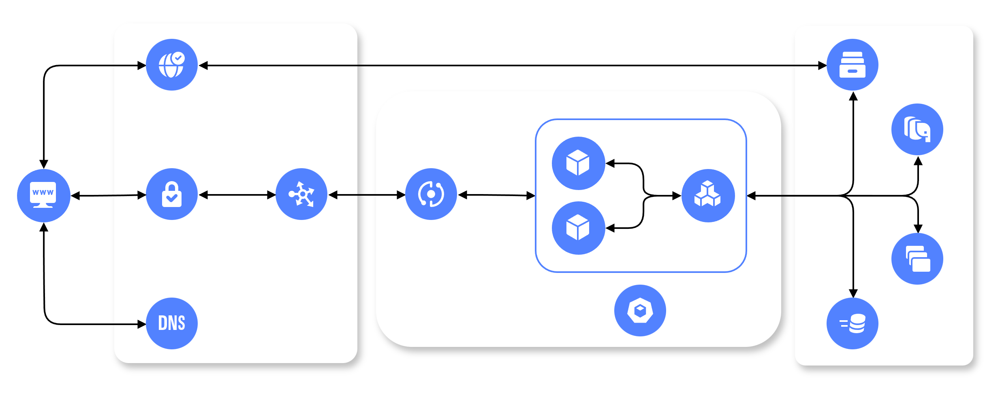

# Общее устройство сети Интернет

Почему веб сложнее, чем нам кажется, и что в него входит

<!-- .slide: style="text-align: center"  -->

---



Вот такой непростой бэкенд...

Note:
В проде “сервер” — это не один процесс. Почти всегда это набор компонентов: на краю CDN и прокси, дальше балансировщик/ingress, иногда gateway/BFF, потом runtime и ваше приложение, и за ним зависимости: база, кеш, очереди, объектное хранилище. Сегодня мы будем возвращаться к этой схеме много раз.

<!-- .slide: style="text-align: center"  -->

---

## Что посмотрим

1. Что из себя представляет HTTP и для чего используется;
2. Роли промежуточных звеньев при обработке запроса;
3. Какие есть способы развёртывания этой инфраструктуры;
4. Как индустрия пришла к такой картине.

Из дальнейшего сегодня не посмотрим только DDD, но про него будет две следующие лекции.

Note:
План такой: сначала запрос как “поток” через инфраструктуру, затем где живёт ваш код, потом безопасность и состояние, затем данные и асинхронность, потом карта API-подходов и короткая история — как объяснение, почему индустрия пришла к этим решениям. DDD сегодня не раскрываем: это отдельный блок про внутреннюю организацию бизнес-логики.

---

## Структура HTTP-запроса и ответа

<!-- .slide: style="text-align: center"  -->

Note:
В этом блоке фиксируем основу, на которой строятся все следующие темы курса. Сначала разбираем, из чего состоит запрос и ответ на уровне протокола, затем переходим к тому, как эти сообщения проходят через инфраструктурные слои. Цель: научиться видеть в HTTP не только “данные”, но и контракт, по которому взаимодействуют клиент, прокси и приложение.

---

## Жизненный цикл запроса

* В основном запросы приходят в приложение не напрямую (даже если не брать в расчёт сетевую инфраструктуру).

* Каждый промежуточный этап вносит свою сложность.

* Важно понимать, где могла произойти ошибка, по ответу на запрос.

Note:
Привычка “всё про баг в коде” часто не работает. Бывает, что приложение в порядке, а запрос режется по rate limit на edge, или таймаутится на балансировщике, или умирает на зависимости. Поэтому базовый навык — понимать маршрут запроса и быстро отвечать “где вероятнее всего сломалось”.

---

## HTTP-запрос

Запрос обычно направлен на работу с ресурсом. Технически он содержит:

* Стартовую строку: метод, путь, версия протокола;
* Заголовки: метаданные и политики;
* Тело: данные запроса (если метод это предполагает).

Ресурсы могут быть **статическими** или **динамическими** в зависимости от способа их получения.

```http[]
GET / HTTP/1.1
Host: de.ifmo.ru
Accept: text/html,application/json;q=0.9
Accept-Language: ru-RU,ru;q=0.9
Accept-Encoding: gzip, br
Cache-Control: max-age=0
User-Agent: Mozilla/5.0 (Windows NT 10.0; Win64; x64; rv:97.0) Gecko/20100101 Firefox/97.0
```

Note:
Сервер получает стартовую строку, заголовки и, при необходимости, тело. На этом уровне протокол “не знает” вашу бизнес-логику. Фреймворки добавляют удобство, но базовая структура всегда одна и та же.

На слайде показан сокращённый пример. В реальном браузерном запросе заголовков обычно больше: `Connection`, `Sec-Fetch-*`, `DNT`, `Upgrade-Insecure-Requests` и другие. Для вводной лекции важно запомнить роли основных полей: `Host` определяет виртуальный хост, `Accept` и `Accept-Language` описывают предпочтения клиента, `Accept-Encoding` управляет сжатием.

Ключевой практический вывод: проектировать API нужно как контракт. Нужно явно понимать, какие поля обязательны, какие значения валидны и как сервис реагирует на пропущенные или некорректные данные.

---

## HTTP-ответ

* Код статуса: общий результат обработки запроса;
* Заголовки: политики ответа и служебные параметры;
* Тело: полезные данные или описание ошибки.

```http[]
HTTP/1.1 200 OK
Server: nginx
Content-Type: text/html
Content-Length: 1256
Vary: Accept-Encoding
Cache-Control: public, max-age=300
Content-Encoding: gzip

(content)
```

Note:
Ответ — это не только “json”. Статус-код сообщает класс результата, заголовки задают правила обработки ответа, тело несёт данные или ошибку.

На слайде оставлены ключевые поля. На практике часто встречаются также `Transfer-Encoding`, `ETag`, `Last-Modified`, `Set-Cookie`, `Strict-Transport-Security`, `X-Content-Type-Options`. Их комбинация зависит от типа ресурса и политики безопасности.

Чем стабильнее и предсказуемее контракт ошибок (коды + структура тела), тем проще поддерживать клиентов и автоматизировать мониторинг.

---

## Зачем помнить коды статуса HTTP

Правильно возвращаемые коды статуса могут давать много полезной информации. Например:

* 400: ошибка в запросе клиента;
* 500: внутренняя ошибка приложения;
* 502: один из промежуточных слоёв недоступен;
* 503: временная недоступность сервиса по разным причинам.

Note:
500 чаще про ваш код и вашу обработку. 502 — чаще про связку “прокси ↔ приложение”: таймаут, краш процесса, не тот порт, перегруз. 503 — про недоступность сервиса или защитные механизмы. Умение различать эти классы экономит часы дебага.

---

## HTTP-методы и их свойства

При выполнении запросов нужно держать в голове свойства **безопасности** (не изменяет данные) и **идемпотентности** (устойчив к повторам) методов. Например:

* `GET`: безопасный и идемпотентный;
* `PUT`: идемпотентный, но не безопасный;
* `POST`: не безопасный и не идемпотентный.

Если метод не идемпотентный, то повтор одного и того же запроса может вызвать дубликаты.

Note:
Эти свойства напрямую влияют на то, можно ли повторять запрос. Инфраструктура и клиенты ретраят чаще, чем кажется: из-за таймаутов, сетевых потерь, перегрузок. Если операция не идемпотентна, повтор может создать дубликат. Это станет критично, когда дойдём до очередей и “at-least-once”.

---

## Способы использования HTTP-заголовков

* Аутентификация и авторизация: `Authorization`, `Cookie`;
* Контракт на формат данных: `Content-Type`, `Accept`;
* Кэширование: `Cache-Control`, `ETag`;
* Трассировка запросов: `X-Request-Id`.

Это не исчерпывающий список заголовков, но достаточный, чтобы увидеть их разнообразие.

Note:
Заголовки — это то, что “склеивает” слои. `Authorization` и `Cookie` определяют контекст пользователя. `Content-Type`/`Accept` — как парсить и что отдавать. `Cache-Control`/`ETag` — ускорение через кеш. `X-Request-Id` нужен, чтобы связать логи прокси, приложения и зависимостей.

---

## Аутентификация и авторизация

* `AuthN` (authentication): подтверждение личности пользователя;
* `AuthZ` (authorization): проверка прав на действие;
* `Cookie`, `Set-Cookie`: stateful-подход через сессионный идентификатор;
* `Authorization`: stateless-подход через токены.

Оба подхода активно используются на практике. При сессиях нужно общее хранилище для масштабирования. С токенами проще горизонтальное масштабирование, но сложнее управлять жизненным циклом.

Note:
Горизонтальное масштабирование любит stateless. Как только состояние завязано на конкретный инстанс, вы упираетесь в sticky sessions, проблемы рестарта и невозможность быстро масштабироваться. Поэтому мы либо держим состояние в общей системе (Redis/DB), либо переносим часть состояния в токены.

Классическая веб-схема: в cookie — только идентификатор, всё состояние — в session store. Плюс: легко инвалидировать, легко управлять сессиями, удобно для веба. Минус: нужна инфраструктура session store и дисциплина, особенно при масштабировании.

Токены удобны, когда у вас много клиентов и вы хотите минимизировать серверное состояние. Но цена — контроль жизненного цикла: ревокация, ротация, компрометация. Важно не превращать токен в “контейнер всей системы”: минимум данных, минимум прав, короткая жизнь access-токена.

---

## Контракт на формат данных

* `Accept`: какие форматы клиент готов получить в ответе;
* `Content-Type`: формат тела текущего HTTP-сообщения.

Контракт в этих заголовках может варьироваться по сложности, начиная с <q>принимаю JSON</q> и заканчивая <q>охотно принимаю JSON для API версии 1.4, неохотно принимаю XML для API версии 1.3</q>.

Note:
Частая ошибка — принимать “что угодно” и падать внутри. Лучше явно договариваться: какие форматы входа поддерживаются, какие форматы выхода гарантируются и как сервис отвечает на несовместимый формат.

Важно не путать роли: `Accept` — это ожидание клиента к ответу, `Content-Type` — это факт о формате тела конкретного сообщения. Для запроса `Content-Type` говорит серверу, как парсить тело; для ответа — как клиенту интерпретировать данные.

---

## Что между клиентом и бизнес-логикой сервера?

<!-- .slide: style="text-align: center"  -->

Note:
Теперь переходим от протокола к инфраструктуре обработки запроса. Дальше смотрим, какие промежуточные слои стоят между клиентом и кодом приложения, какие задачи решает каждый слой и как они влияют на задержку, надёжность и наблюдаемость.

---

## Таймауты и повторы

* Где могут появиться таймауты: клиент, прокси, приложение, СУБД.

* Если не задавать таймауты самостоятельно, они появятся неожиданно и (скорее всего) что-то сломают.

* Для грамотной обработки повторов необходим правильно спроектированный API в разрезе идемпотентности.

Note:
В проде нет “ждём сколько надо”. Время ограничено на каждом слое. Если вы не поставили таймаут в коде — его поставит прокси или клиент, но уже без вашей логики и без аккуратной деградации. Ретраи усиливают нагрузку и могут создавать дубликаты. Поэтому идемпотентность и асинхронность — не абстракция.

---

## Слои обработки запроса

* Внешний периметр (обратный прокси-сервер): работа с TLS, ускорение и маршрутизация запросов внутрь;

* Балансировка нагрузки: распределение запросов и проверка жизнеспособности;

* API Gateway и BFF: политики запросов и адаптация контракта;

* Среда выполнения и само приложение: непосредственно код с бизнес-логикой.

Note:
Здесь важная мысль: разные компоненты решают разные задачи. Если пытаться делать всё “в приложении”, вы получите хаос: часть безопасности окажется в одном сервисе, часть — в другом, кеш будет “как получится”. Edge и gateway нужны для единых правил, а приложение — для предметной логики.

---

## Обратный прокси-сервер (edge)

* TLS-терминация
* Отдача статических ресурсов и их сжатие
* Маршрутизация и ограничение RPS
* Опционально кэширование и WAF

Note:
Edge — это “периметр”. Он принимает внешний трафик, завершает TLS, сжимает ответы, раздаёт статику, режет очевидные злоупотребления, иногда кеширует. Это слой, который дешевле масштабировать и который должен защищать приложение от лишней работы.

---

## Балансировщик нагрузки

* Балансировка запросов на несколько инстансов;
* Проверка состояния инстансов (живы и готовы работать);
* Поддержка sticky-сессий.

Note:
Балансировщик решает, куда отправить запрос. Healthchecks — критичны: “процесс жив” не значит “готов обслуживать”. Sticky sessions часто появляются, когда сессии лежат в памяти; это костыль. Правильная цель — stateless-инстансы и общие хранилища для состояния.

---

## API Gateway и BFF

* API Gateway — единая входная точка для API.
* Обычно на нём: проверка доступа, лимиты, маршрутизация, логирование.
* BFF (Backend for Frontend) — отдельный API под конкретный клиент.
* BFF помогает убрать лишние запросы и адаптировать формат данных.
* Общая идея: единые инфраструктурные правила до бизнес-логики.

Note:
Этот слайд нужен, чтобы разделить две роли. API Gateway — это инфраструктурный слой с общими правилами. BFF — это прикладной слой адаптации API под конкретный тип клиента.

На вводной лекции важно запомнить интуицию: чем больше клиентов и чем сложнее backend-ландшафт, тем больше смысла выносить общие политики в gateway и клиентскую адаптацию в BFF.

Подробно эти паттерны разберём в лекции 10: где проходит граница ответственности, когда BFF оправдан, а когда это лишняя сложность.

---

## Runtime vs приложение: пайплайн обработки

* Runtime: принимает соединение, управляет жизненным циклом запроса.
* Middleware/guards: базовые проверки, контекст, безопасность.
* Controller: слой HTTP-контракта.
* Service/use-case: выполнение прикладного сценария.
* Repository/adapters: доступ к данным и внешним системам.
* На выходе: предсказуемый ответ и обработка ошибок.

Note:
Здесь важно показать, что “сервер” и “приложение” — не одно и то же. Runtime решает сетевые и платформенные задачи, а приложение — бизнесовые.

Если смешать роли, вы быстро получите хрупкий код: правила доступа в контроллере, SQL в сервисе, бизнес-валидацию в middleware. На вводном уровне достаточно запомнить: слои нужны для управляемости и тестируемости.

Позже, в лекциях 2 и 3, мы наложим на эту схему DDD-подход и отдельно разберём, где должны жить доменные правила и как строить доступ к данным.

---

## DB как узкое место по умолчанию

* База данных — общий ресурс для всех инстансов приложения.
* Главные риски: задержка, блокировки, конкуренция за соединения.
* Пул соединений ограничивает одновременную нагрузку на БД.
* Длинные транзакции ухудшают параллелизм и стабильность.
* Оптимизация доступа к БД почти всегда даёт заметный эффект.

Note:
Вводная мысль простая: приложение может быть “лёгким”, но вся система будет медленной, если перегружена база данных. Поэтому проектирование backend всегда упирается в дисциплину работы с БД.

Первое, что стоит контролировать с самого начала: лимиты пула соединений, время запросов и длительность транзакций. Это базовая операционная гигиена ещё до сложной оптимизации.

Подробный разговор о паттернах доступа к данным и ORM будет в лекции 3, а про системные ограничения и масштабирование — в лекции 9.

---

## ORM и доступ к данным (обзорно)

* ORM связывает объекты приложения и таблицы БД.
* Плюс ORM: меньше шаблонного кода и единая модель данных.
* Минус ORM: можно потерять контроль над реальными SQL-запросами.
* Частые паттерны: Repository и Unit of Work.
* Типичная ловушка: N+1 и лишние запросы в циклах.

Note:
На вводной лекции важно снять иллюзию “ORM всё оптимизирует сама”. ORM ускоряет разработку, но ответственность за производительность и корректную модель данных остаётся у команды.

Repository и Unit of Work на этом этапе можно понимать как способ сделать доступ к данным предсказуемым и централизованным, а не размазанным по всему коду.

Подробно сравним подходы и разберём примеры с TypeORM/Prisma в лекции 3, включая типичные ошибки и способы их диагностики.

---

## Асинхронность: очередь и воркеры

* Долгие и ненадёжные операции лучше выносить из HTTP-запроса.
* Базовая схема: очередь задач → воркер → результат обработки.
* Очередь сглаживает пики и уменьшает время ответа клиенту.
* Доставка обычно не “ровно один раз”, а “как минимум один раз”.
* Поэтому обработчики должны быть идемпотентными.

Note:
Смысл асинхронности в backend — не “модно”, а “устойчиво”: пользователь быстро получает ответ, а тяжёлая работа выполняется отдельно и под контролем повторов.

На уровне вводной лекции достаточно понимать: очередь добавляет надёжность и масштабируемость, но требует дисциплины обработки повторов, ошибок и таймаутов.

В следующих лекциях мы регулярно будем возвращаться к этой теме: в HTTP-контексте (повторы и идемпотентность), в API-проектировании и в блоках про высокую нагрузку.

---

## Кеш + CDN + S3: стандартный набор

* Типичная иерархия: браузерный кэш → CDN → серверный кэш → БД.
* CDN ускоряет выдачу и разгружает центральный источник.
* Объектное хранилище (S3) обычно используется для файлов и медиа.
* Главная инженерная сложность — инвалидация и актуальность данных.
* Кэширование ускоряет систему, но повышает сложность эксплуатации.

Note:
Это один из самых полезных практических паттернов, который вы встретите почти в любом production backend: кэш на нескольких уровнях плюс отдельное хранилище файлов.

Ключевой тезис вводной лекции: кэширование — это не “включить флаг”, а набор решений по TTL, ключам, инвалидации и мониторингу. Если этого нет, кэш быстро становится источником трудноуловимых ошибок.

Подробно и системно этот блок разбирается в лекции 11: политика кэширования, CDN-механика, S3-паттерны и эксплуатационные риски.

---

## Где это всё можно развёртывать

<!-- .slide: style="text-align: center"  -->

Note:
Этот блок даёт обзор моделей развёртывания, чтобы у вас была карта вариантов до детального DevOps-погружения. Смысл не в том, чтобы запомнить все тарифы провайдеров, а в том, чтобы понять компромисс между контролем, стоимостью, скоростью запуска и операционной нагрузкой на команду.

---

## Варианты развёртывания

* Физический выделенный сервер (`Dedicated Server`);
* Виртуальный выделенный сервер (`VDS`/`VPS`);
* Виртуальный хостинг (`Shared Hosting`);
* Управляемый хостинг (`Managed Hosting`);
* Платформа как сервис (`Platform-as-a-Service`, `PaaS`).

Критерии выбора:

* уровень инфраструктурного контроля;
* стоимость владения;
* требуемая экспертиза команды;
* скорость запуска и масштабирования.

Note:
Практически всегда выбор происходит не по одному параметру. Самый частый перекос на старте — выбирать только по цене сервера, игнорируя стоимость поддержки. Команде без сильной инфраструктурной экспертизы часто выгоднее выбрать более управляемую модель и сфокусироваться на продукте.

На ранних этапах проекта главный вопрос обычно звучит так: “где мы быстрее и безопаснее выпустим рабочую версию”. Для этого нередко хватает VDS или PaaS. Когда появляются жёсткие требования к контролю окружения, безопасности или производительности, переходят к более низкоуровневым вариантам.

---

## Физический выделенный сервер

* Полный контроль над железом и ОС;
* Максимальная гибкость конфигурации;
* Высокая предсказуемость ресурсов;
* Самая высокая операционная ответственность;
* Обычно дороже и медленнее в масштабировании.

Note:
Выделенный сервер хорош, когда нужны специфичные настройки окружения, высокий уровень изоляции и контроль над физической инфраструктурой. Такой вариант часто выбирают проекты с особыми требованиями к безопасности, лицензированию или производительности.

Но цена контроля — это эксплуатация. Команда сама отвечает за обновления ОС, безопасность, резервирование, восстановление после отказов и мониторинг железа. Для учебных и ранних продуктовых сценариев это обычно избыточно.

---

## Виртуальный выделенный сервер

* Изолированная виртуальная машина с root-доступом;
* Существенно дешевле физического сервера;
* Баланс контроля и стоимости;
* Ответственность за ОС и приложение всё ещё на команде;
* Частый выбор для pet-проектов и малого продакшена.

Note:
VDS/VPS — это компромиссный “рабочий стандарт” для множества небольших backend-проектов. Провайдер снимает часть проблем физической инфраструктуры, но настройки системы, деплой, безопасность и наблюдаемость остаются вашей задачей.

Если команда умеет администрировать Linux и хочет гибкость без затрат на собственное железо, это обычно разумная отправная точка. На росте нагрузки можно масштабироваться горизонтально, но уже нужна дисциплина автоматизации и инфраструктурного кода.

---

## Виртуальный хостинг

* Минимальная стоимость входа;
* Ограниченный доступ к окружению;
* Общие ресурсы между разными пользователями;
* Сильные ограничения по стеку и конфигурации;
* Подходит только для простых сценариев.

Note:
Виртуальный хостинг исторически удобен для простых сайтов и типовых CMS, где не требуется гибкая серверная логика. Для современного backend с очередями, нестандартными зависимостями и собственным пайплайном деплоя обычно быстро становится тесно.

Главный риск в этой модели — слабый контроль над производительностью и окружением. Вы выигрываете в цене, но платите ограничениями, которые мешают росту проекта.

---

## Управляемый хостинг

* Провайдер берёт на себя администрирование платформы;
* Удобен для типовых приложений и CMS;
* Меньше операционной рутины для команды;
* Ограниченная гибкость настройки;
* Возможны ограничения по производительности и расширяемости.

Note:
Управляемый хостинг закрывает часть DevOps-задач и ускоряет старт, когда требования к архитектуре простые. Это хороший вариант, если важнее быстро запуститься, чем тонко контролировать систему.

Как только проекту нужны нестандартные зависимости, сложные политики безопасности или гибкое масштабирование, ограничений становится слишком много, и команда обычно переходит на VDS, контейнеры или PaaS.

---

## Platform-as-a-Service: что это

* Готовая платформа для запуска приложения;
* Инфраструктурные компоненты “из коробки”:
* среды выполнения;
* базы данных, очереди, объектные хранилища;
* встроенные деплой, мониторинг и масштабирование.

Note:
PaaS переносит фокус команды с администрирования серверов на разработку продукта. Вы не настраиваете систему с нуля, а используете уже подготовленные сервисы платформы: runtime, managed-БД, очереди, логирование, метрики.

Для курса это важная модель, потому что она помогает быстрее добираться до прикладных задач в лабораторных. При этом архитектурные принципы из лекций остаются теми же: контракты API, работа с данными, наблюдаемость и отказоустойчивость.

---

## Platform-as-a-Service: плюсы и ограничения

* Низкий порог входа и быстрый запуск;
* Меньше DevOps-нагрузки на команду;
* Удобно для MVP и продуктовых итераций;
* Стоимость может быть выше VDS;
* Есть риск vendor lock-in.

Note:
Главное преимущество PaaS — скорость поставки. Команда может быстро деплоить, масштабироваться и наблюдать систему без глубокого погружения в эксплуатацию железа и ОС.

Главный риск — зависимость от платформы. Конфигурация деплоя, сетевые ограничения, managed-сервисы и модель ценообразования могут усложнить миграцию к другому провайдеру. Поэтому полезно сразу держать инфраструктурные решения максимально переносимыми.

---

## Platform-as-a-Service: контейнерная модель и примеры

* Обычно приложение запускается в изолированной среде;
* Часто используется контейнерная модель исполнения;
* Масштабирование достигается добавлением экземпляров;
* Платформа управляет балансировкой и перезапусками;
* Типовые примеры: Render, Heroku, Railway, Fly.io.

Note:
Под капотом многие PaaS-системы используют контейнеры или похожую изолированную среду исполнения. Для разработчика это выглядит как “запушил код — получил работающий сервис”, но на самом деле платформа выполняет сборку, запуск, health checks и масштабирование.

В лабораторных мы используем платформу, которая даёт быстрый старт без сложной инфраструктурной настройки. Это позволяет сфокусироваться на архитектуре приложения, а не на ручном администрировании.

---

## Почему современный state of the art такой сложный

<!-- .slide: style="text-align: center"  -->

Note:
Завершаем вводную лекцию историческим контекстом. Ни один из слоёв, которые мы обсуждали, не появился “сразу правильным”. Дальше покажем короткую эволюцию подходов, чтобы было понятно, какие реальные ограничения привели индустрию к текущей многослойной архитектуре.

---

## CGI → Templates → MVC

* CGI: отдельный процесс на запрос, простая модель, слабая масштабируемость.
* Шаблоны: быстрее собирать HTML, но легко смешать слои.
* MVC: разделение на представление, логику и данные.
* Главный результат эволюции — явные архитектурные границы.

Note:
Мы смотрим этот слайд не ради исторического экскурса, а чтобы понять происхождение современных практик. Каждая следующая модель решала ограничения предыдущей: от масштабируемости CGI до управляемости кода в MVC.

На вводном уровне важно вынести один вывод: идеи разделения ответственности появились не “по учебнику”, а как ответ на реальные эксплуатационные боли.

В следующих лекциях это проявится в конкретных формах: в DDD (лекции 2–3), в API-дизайне (лекции 6–7) и в инфраструктурных паттернах (лекции 10–11).

---

## MVC → SPA/API: новая реальность

* Клиентские приложения стали “толще” (SPA, мобильные клиенты).
* Сервер всё чаще работает как API-платформа.
* Появляется жёсткий контракт: форматы, ошибки, версии.
* Растёт роль безопасности, ограничений и наблюдаемости API.

Note:
Когда фронтенд и мобильные клиенты стали самостоятельными приложениями, backend перестал быть “генератором HTML” и стал стабильным интерфейсом для нескольких потребителей.

Отсюда выросли требования к API-контракту: документация, предсказуемые ошибки, политика версий, ограничения сложности запросов и единые правила безопасности.

Детали разберём по частям: HTTP и его расширения (лекции 4–5), REST/GraphQL/gRPC (лекции 6–7), аутентификация и авторизация (лекция 8).

---

## Почему edge и кэш стали нормой

* Рост трафика сделал обязательными CDN и многоуровневый кэш.
* Рост числа сервисов сделал востребованными gateway и BFF.
* Часть задач выгоднее решать на edge до приложения.
* Современный фронтенд часто использует гибридные подходы (SSR/SSG/ISR).
* Цель: баланс скорости, стоимости, надёжности и управляемости.

Note:
Этот слайд связывает весь вводный рассказ: современная веб-архитектура стала многослойной не из-за “моды”, а из-за ограничений производительности, безопасности и стоимости.

Edge-слой берёт на себя то, что дешевле и безопаснее делать до приложения: фильтрацию трафика, базовые политики, ускорение доставки. Внутри системы gateway/BFF помогают удерживать API-контракты под контролем при росте числа сервисов и клиентов.

Дальше по курсу мы раскроем это по отдельным блокам: архитектурные компромиссы нагруженных систем (лекция 9), gateway/BFF (лекция 10), кэширование/CDN/S3 (лекция 11).

---

## Что дальше?

* Предметно-ориентированное проектирование и программирование;

* Протокол HTTP: история появления и развития, различные версии, приложения;

* Подходы к организации API: уровни зрелости, REST, GraphQL;

* Аутентификация и авторизация;

* Основы системного дизайна, различные типы масштабирования;

* Асинхронное взаимодействие;

* Балансировщики нагрузки, API Gateway, Backend For Frontend;

* Распределённое хранение данных для различных задач (CDN, S3).

Note:
Два вопроса, чтобы “зафиксировать” мышление: где вы бы ставили лимиты — в приложении или на edge, и почему. И когда вы бы выбрали GraphQL вместо REST — и какие ограничения добавили бы сразу, чтобы не получить N+1 и DoS сложными запросами.

---

## Вопросы?

<!-- .slide: style="text-align: center"  -->

Note:
Для закрепления можно обсудить один реальный пользовательский запрос и вместе пройти его путь по слоям: какие заголовки важны, где стоят таймауты, где возможны повторы, где узкое место по данным и какая модель развёртывания была бы уместна для такого сервиса на старте.
