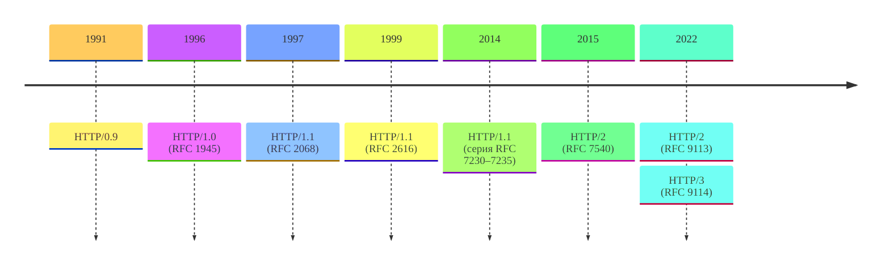
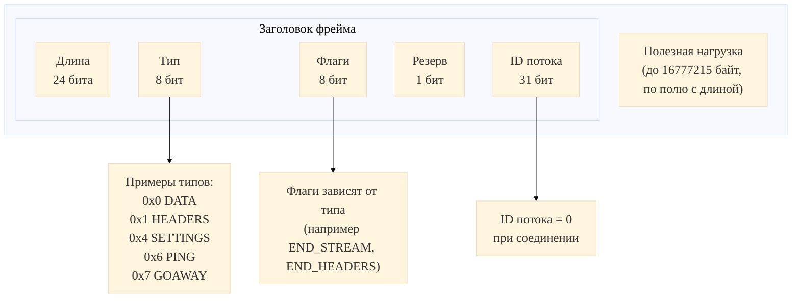

# Устройство протокола HTTP
  
HTTP/1.1 200 OK

<!-- .slide: style="text-align: center" -->

---

## HTTP в архитектуре веба

Что было на момент создания современного веба:

* Стек TCP/IP;
* Сеть Интернет;
* Система DNS.

Что остаётся добавить для современного веба?

Note:

Возвращаемся к лекциям про сам веб :)

Как мы помним, web-сайт&nbsp;— это набор логически связанных ресурсов, объединённых одним доменом или IP-адресом. Ресурсы при этом могут быть статическими и динамическими.

Появляется закономерный вопрос: как можно организовать взаимодействие клиента и сервера, чтоб в итоге можно было получить нужные ресурсы? К моменту начала разработки необходимых для современного веба технологий уже вовсю работала сеть Интернет поверх стека TCP/IP и системы доменных имён (раз мы говорим про домены и IP-адреса). Посмотрим, чего не хватает в этой схеме для получения полноценного веба.

---

## Базовые компоненты HTTP

Базовых компонента четыре:

* Формат представления гипертекстовых документов (**HTML**);

* Клиент для просмотра и редактирования таких документов (**браузер**);

* Сервер для организации доступа к этим документам в виде ресурсов;

* И протокол обмена такими документами (**HTTP**).

<div class="fragment">

Эти компоненты были спроектированы и разработаны одним человеком, физиком [Тимом Бернерсом-Ли](https://ru.wikipedia.org/wiki/%D0%91%D0%B5%D1%80%D0%BD%D0%B5%D1%80%D1%81-%D0%9B%D0%B8,_%D0%A2%D0%B8%D0%BC).

</div>

Note:

Современный веб на самом деле основан на четырёх составляющих: формата документов, клиента и сервера, а также протокола обмена такими документами между клиентом и сервером.

Забавный факт: все эти составляющие исходно были придуманы и разработаны одним человеком, физиком ЦЕРНа **Тимом Бернарсом-Ли** (хотя по факту он всё равно был специалистом в области информатики).

---

## Краткая история развития HTTP

<!-- .slide: style="text-align: center" -->

---

## HyperText Transfer Protocol

**Протокол передачи гипертекста (HyperText Transfer Protocol, HTTP)**&nbsp;— это прикладной клиент-серверный протокол для передачи гипертекстовых документов. На самом деле, сейчас он используется для ресурсов любого типа, не только гипертекста.

---

<!-- .slide: style="text-align: center" -->



Таймлайн версий HTTP

NB: **RFC**&nbsp;— [Request for Comments (рабочее предложение)](https://ru.wikipedia.org/wiki/RFC)

Note:

На этот таймлайн интересно посмотреть даже не с той точки зрения, что в нём слишком большие перерывы между мажорными версиями. На самом деле, здесь хорошо видно, что HTTP текущих версий хорошо справлялся со своими задачами ровно до тех пор, пока не начинали появляться другие, и протокол адаптировался под новые вызовы. Дальше мы на эти вызовы и способы решения как раз посмотрим.

---

## HTTP/0.9

Версию **HTTP/0.9** ещё называют однострочным протоколом:

```http []
GET /index.html
```

Запрос состоит из двух частей: метода запроса (только `GET`) и URI ресурса.

<div class="fragment">

Ответом обычно был просто HTML-документ без метаданных:

```html []
<html>
  A very simple page
</html>
```

Из-за этого клиенту было сложно автоматически понять тип ошибки и её причину.

</div>

Note:

Самая первая публичная версия протокола (март 1991 года) впоследствии получила номер 0.9. Это был крайне простой протокол, который ещё называют однострочным. Это название он получил, поскольку весь запрос состоял ровно и одной строки, никаких заголовков и прочего такого. Первое слово обозначает действие, которое мы хотим выполнить с ресурсом,
его называют **HTTP-методом** или **HTTP-глаголом**. В версии 0.9 метод один, `GET`, на получение ресурса.

После метода идёт URI ресурса, но без указания протокола, домена и прочего, указывается только путь к ресурсу.

В качестве ответа передавался HTML-документ как он есть, без всякой дополнительной информации. Это просто, но нет никакого указания на то, был ли успешно выполнен запрос или нет. Обычно, если происходила ошибка, просто формировалась специальный HTML-документ, и дальше пользователь должен был сам понять, что пошло не так. Автоматическая обработка ошибок была не самым простым занятием.

---

## HTTP/1.0

Как эти проблемы решили в **HTTP/1.0** (RFC 1945):

* В первой строке появилась версия протокола;
* Появились новые методы `POST` и `HEAD`;
* Появились стандартизованные **коды статуса**;
* Добавилась концепция **HTTP-заголовков**;
* Стало возможным передавать не только гипертекст за счёт заголовка `Content-Type`.

Note:

Понятно, что на таком протоколе далеко не уедешь и веб не построишь. За короткий промежуток времени появились нестандартные расширения протокола (май 1996 года):

* В запросах и ответах начали передавать информацию о версии протокола, чтобы отличать их друг от друга во время передачи данных. На этот момент для удобства указывали версию **HTTP/1.0**.

* В дополнение к методу `GET` появились методы `POST` и `HEAD`.

* Появилась концепция **HTTP-заголовков**: наборов пар "ключ-значение", передающих метаинформацию как серверу, так и клиенту;

* В первой строке ответа вместе с версией протокола передаётся **код статуса**. Этот код позволяет передать информацию о результате выполнения запроса в стандартизованном виде. Код статуса может проинструктировать браузер, например, перейти по другой ссылке или сбросить кэш.

* Появилась возможность передавать разные типы ресурсов за счёт использования специального заголовка `Content-Type`.

---

## HTTP/1.0

Теперь HTTP-запрос мог выглядеть так:

```http []
GET /index.html HTTP/1.0
User-Agent: NCSA_Mosaic/2.0 (Windows 3.1)
```

И ответ на такой запрос может выглядеть так:

```http [|1|2-4|6-9|4]
HTTP/1.0 200 OK
Date: Tue, 15 Nov 1994 08:12:31 GMT
Server: CERN/3.0 libwww/2.17
Content-Type: text/html

<HTML>
A page with an image
  
</HTML>
```

Note:

Разберём пример запроса и возможного ответа на него. Обратите внимание, что дальше концептуально структура сообщения всегда будет такой: сначала стартовая строка, затем строки с заголовками и дальше тело, отделённое пустой строкой.

Обратите внимание, что заголовок `Content-Type` идёт последним, и после него сразу идёт тело ответа. Это объясняет то, что CGI-приложения были обязаны сами выводить этот заголовок: в противном случае веб-сервер не мог определить тип контента.

---

## Проблемы HTTP/1.0

HTTP/1.0 отработал в своём виде недолго из-за бурного развития веба:

* Больше контента на странице → больше файлов → больше TCP-соединений → больше накладных расходов;
* Исчерпание адресов IPv4 и использование частных сетей;
* Низкая надёжность имеющейся инфраструктуры.

Note:

HTTP/1.0 хоть и был в итоге зафиксирован в RFC 1945, но не стал именно стандартом. Он неплохо решал задачу раннего веба, но плохо масштабировался под новую нагрузку. Страницы стали состоять не из одного HTML-файла, а из набора ресурсов (изображения, скрипты, стили), и на каждый ресурс приходилось открывать отдельное TCP-соединение. Дополнительно усложнялась сетевая инфраструктура: возникла массовая потребность размещать много сайтов на одном сервере и одном IP-адресе, а также корректно работать в условиях менее стабильных сетей. Эти предпосылки и подтолкнули эволюцию к HTTP/1.1.

---

## HTTP/1.1

Как эти проблемы решал **HTTP/1.1** (RFC 2068):

* Переиспользование соединения для передачи нескольких документов за раз (заголовок `Keep-Alive`);
* Конвейерная обработка запросов (пайплайнинг, спорная технология, которая в итоге нигде не была реализована);
* Новые стандартные HTTP-методы (`PUT`, `PATCH`, `DELETE` и пр.);
* Поддержка фрагментированных ответов (заголовок `Transfer-Encoding`);
* Механизмы управления кэшем браузера (заголовки `Cache-Control` и `ETag`);
* Согласование формата передаваемых данных (заголовки `Accept-*`);
* Возможность обслуживания нескольких доменов с одного публичного IP-адреса (заголовок `Host`).

Note:

Таковым стал **HTTP/1.1** (RFC 2068) спустя несколько месяцев после HTTP/1.0 (январь 1997 года). Что в нём улучшилось:

* Появилась возможность использовать одно и то же соединение для получения нескольких документов (заголовок `Keep-Alive`). Это ускорило загрузку страниц с дополнительными ресурсами, так как сняло накладные расходы на установку TCP-соединений.
* Появилась **конвейерная обработка запросов**, позволяющая отправлять второй запрос до того момента, как полностью будет передан первый. В теории это полезно, но на практике так и не было реализовано должным образом и сейчас не используется.
* Появились новые стандартные HTTP-методы (`PUT`, `PATCH`, `DELETE` и пр.), что дало улучшенную семантику запросов.
* Добавлена поддержка фрагментированных ответов. Это нужно, например, чтобы не слать большой ответ за один раз.
* Появились дополнительные механизмы управления кэшем браузера в виде заголовков.
* Появились дополнительные заголовки для согласования работы с передаваемыми данными (кодировки, языки).
* Появилась возможность обслуживать несколько доменных имён с одного IP-адреса с помощью специального заголовка `Host`.

---

<!-- .slide: style="text-align: center" -->

```http []
GET /en-US/docs/Glossary/CORS-safelisted_request_header HTTP/1.1
Host: developer.mozilla.org
User-Agent: Mozilla/5.0 (Macintosh; Intel Mac OS X 10.9; rv:50.0) Gecko/20100101 Firefox/50.0
Accept: text/html,application/xhtml+xml,application/xml;q=0.9,*/*;q=0.8
Accept-Language: en-US,en;q=0.5
Accept-Encoding: gzip, deflate, br
Referer: https://developer.mozilla.org/en-US/docs/Glossary/CORS-safelisted_request_header
```

Пример запроса HTTP/1.1

---

<!-- .slide: style="text-align: center" -->

```http [|7]
HTTP/1.1 200 OK
Connection: Keep-Alive
Content-Encoding: gzip
Content-Type: text/html; charset=utf-8
Date: Wed, 20 Jul 2016 10:55:30 GMT
Etag: "547fa7e369ef56031dd3bff2ace9fc0832eb251a"
Keep-Alive: timeout=5, max=1000
Last-Modified: Tue, 19 Jul 2016 00:59:33 GMT
Server: Apache
Transfer-Encoding: chunked
Vary: Cookie, Accept-Encoding

<!doctype html>
<html lang="en-US" data-theme="light dark" data-renderer="Doc">
  <head>
    <meta charset="UTF-8" />
    <meta name="viewport" content="width=device-width, initial-scale=1.0"/>
    <title>CORS-safelisted request header - Glossary | MDN</title>
    ...
```

Пример ответа HTTP/1.1

Note:

Здесь интересно посмотреть на заголовок `Keep-Alive`, который прямо инструктирует браузер, что TCP-соединение нужно держать открытым минимум 5 секунд, за это отвечает параметр `timeout`. Примечательно, что параметр `max` в текущее время не используется, так как имеет смысл только для конвейерной обработки.

---

## Проблемы HTTP/1.1

К середине 2010-х ограничения HTTP/1.1 стали заметны в реальных приложениях:

* В одном соединении запросы фактически обрабатывались последовательно;
* Для ускорения браузеры открывали много TCP-соединений к одному хосту;
* Текстовые заголовки занимали лишний трафик и часто повторялись;
* Потери времени на задержки росли из-за большого числа мелких запросов;
* Фронтенд был вынужден использовать обходные приёмы.

Note:

Очень долгое время протокол HTTP/1.1 использовался так, как есть, и поверх него просто надстраивались новые заголовки для решения новых задач (например, CORS и CSP). Принципиально ничего не изменялось.

При этом объём трафика рос, и HTTP/1.1 хуже справлялся со своей задачей: браузеру приходилось открывать несколько параллельных соединений к одному хосту, чтобы ускорить загрузку, а это увеличивало накладные расходы на установку и поддержку соединений. При этом было негласное ограничение в 6 соединений к одному серверу, чтобы не перегружать канал.

Из-за этого (и не только) фронтенд-команды были вынуждены применять инфраструктурные обходы, чтобы обойти ограничения протокола: объединять ресурсы, использовать спрайты и распределять статику по нескольким поддоменам (`sprite`, `bundling`, `domain sharding`). Когда у протокола появляется слишком много таких обходных практик, это обычно сигнал, что пора менять не только "настройки", но и сам формат транспортного взаимодействия.

---

## HTTP/2

Новым вызовам&nbsp;— новая версия протокола, **HTTP/2** (RFC 7540). Что нового:

* Протокол стал **бинарным** и перешёл на работу с фреймами;
* Появилась поддержка **мультиплексирования**;
* Добавилось сжатие заголовков (алгоритм **HPACK**).

Для серверных приложений запросы и ответы никак не поменялись, поэтому протокол быстро стал популярным.

Note:

В начала 2010-х Google начала разработку альтернативного протокола SPDY (читается как *speedy*). В дальнейшем на его основе был разработан протокол **HTTP/2** (RFC 7540), февраль 2015 года.

HTTP/2 крайне быстро был принят сообществом, поскольку не требовал дополнительных изменений на стороне приложений. Единственное, что нужно было обновить&nbsp;— веб-сервер и браузер (старые версии ПО, ожидаемо, не поддерживают HTTP/2).

Что при этом изменил HTTP/2 по сравнению с HTTP/1.1:

* Протокол стал **бинарным**, тогда как до этого был текстовым. Теперь сервер и клиент обмениваются **фреймами**, которые напоминают такие же, например, в протоколах транспортного уровня.
* HTTP/2 поддерживает **мультиплексирование**: по одному и тому же соединению может обрабатываться несколько запросов, что снижает накладные расходы на открытие соединений.
* Протокол сжимает заголовки, это полезно, когда их много и когда они повторяются. Для сжатия используется специальный алгоритм **HPACK**, заточенный именно под заголовки.

HTTP/2 меняет способ передачи, но не ломает семантику протокола. Для разработчика это важно: методы, коды и заголовки остаются знакомыми, а производительность улучшается.

---

<!-- .slide: style="text-align: center" -->



Структура фрейма HTTP/2

Note:

В HTTP/2 данные передаются не текстовыми строками, а бинарными фреймами.

* У каждого фрейма есть заголовок 9 байт: `Length`, `Type`, `Flags`, `Stream ID`
* После заголовка идёт payload переменной длины
* Типы фреймов: `HEADERS`, `DATA`, `SETTINGS`, `WINDOW_UPDATE`, `PING`, `GOAWAY`
* Логически каждый запрос/ответ привязан к своему `Stream ID`

Важно видеть, что фрейм всегда несёт тип и идентификатор потока, поэтому в одном соединении можно безопасно перемешивать данные разных запросов. За счёт этого и работает мультиплексирование.

---

## Алгоритм сжатия HPACK

[**HPACK**](https://httpwg.org/specs/rfc7541.html) (RFC 7541) уменьшает объём заголовков за счёт трёх идей:

* Статическая таблица часто встречающихся заголовков;
* Динамическая таблица заголовков, уже встречавшихся в этом соединении;
* Дополнительное кодирование строковых значений алгоритмом Хаффмана.

Note:

Важно, что HPACK сжимает именно заголовки, а не тело запроса или ответа. В реальном трафике заголовки часто повторяются, поэтому выигрыш получается заметным, особенно при большом количестве запросов в одном соединении. В то же время HPACK работает в состоянии соединения: сторонам нужно синхронно поддерживать одинаковое состояние таблиц.

---

<div style="display: grid; grid-template-columns: 1fr 1fr; gap: 64px; align-items: center">

<div>

| Индекс | Заголовок                        |
| :----: | -------------------------------- |
|   2    | `:method: GET`                   |
|   3    | `:method: POST`                  |
|   4    | `:path: /`                       |
|   7    | `:scheme: https`                 |
|   8    | `:status: 200`                   |
|   16   | `accept-encoding: gzip, deflate` |
|   31   | `content-type`                   |
|   58   | `user-agent`                     |

</div>

<div>

Исходный фрагмент:

```text
:method: GET
:scheme: https
:path: /
accept-encoding: gzip, deflate
```

HPACK закодирует это так: `2, 7, 4, 16`

</div>

</div>

---

## Проблемы HTTP/2

Даже после успеха HTTP/2 оставались ограничения на уровне транспортного протокола:

* Потеря TCP-пакета влияет на несколько HTTP-потоков;
* Задержки при установке соединения и TLS-рукопожатии;
* Пересоздание соединения при смене IP-адреса.

Note:

HTTP/2 решил много проблем на уровне формата, но часть задержек всё равно оставалась из-за TCP. Для современных приложений с большим количеством параллельных запросов это стало ощутимым узким местом. Поэтому следующий шаг выглядел естественно: сохранить привычный HTTP-интерфейс и перенести его на новый транспорт, который лучше работает в условиях потерь и нестабильной сети.

---

## HTTP/3

Идея нового транспортного протокола породила **HTTP/3** (RFC 9114). Этим протоколом стал **QUIC** (модификация UDP).

Что даёт QUIC сам по себе:

* Шифрование соединения предусмотрено протоколом исходно;
* Несколько потоков данных в одном соединении;
* Независимость разных потоков, низкое влияние потери пакета;
* Наличие ID соединения, даёт гибкость при смене IP-адреса.

<div class="fragment">

Это и даёт основное преимущество HTTP/3: работа для транспортного уровня всё-таки ушла в транспортный протокол.

</div>

Note:

Дальнейшее развитие протокола получило отражение в HTTP/3 (июнь 2022 года). Основное отличие от прошлых версий&nbsp;— замена TCP на специальный протокол QUIC (Quick UDP Internet Connections).

Что даёт такая замена:

* Работа с шифрованием TLS из коробки (про шифрование в следующей лекции);
* Независимая доставка разных потоков данных по одному соединению, что невозможно при использовании TCP (поскольку он гарантирует порядок доставки);
* Поддерживается миграция соединений, т.е. данные передаются клиенту даже при смене IP-адреса, например, в мобильных сетях и в целом в беспроводных сетях.

Главный выигрыш QUIC в том, что потеря пакета замедляет только конкретный поток, а не всё соединение целиком. На нестабильной сети это заметно снижает задержку и количество визуальных подвисаний в клиенте. И это же является преимуществом HTTP/3.

---

| Версия | Транспорт | Формат | Мультиплексирование |      Поведение при потере пакетов       |
| :----: | :-------: | :----: | :-----------------: | :-------------------------------------: |
|  0.9   |    TCP    | Текст  |         Нет         |     Текущее соединение блокируется      |
|  1.0   |    TCP    | Текст  |         Нет         |     Текущее соединение блокируется      |
|  1.1   |    TCP    | Текст  |     Ограничено      |     Текущее соединение блокируется      |
|   2    |    TCP    | Фреймы |         Да          | Потери в TCP могут задержать все потоки |
|   3    | QUIC/UDP  | Фреймы |         Да          | Потери локализуются в отдельном потоке  |

---

## Структура HTTP-сообщений

<!-- .slide: style="text-align: center" -->

---

## Что такое HTTP-сообщение

И запрос, и ответ состоят из:

* Стартовой строки;
* Заголовков;
* Пустой строки-разделителя;
* Тела (опционально).

Эта структура помогает одинаково читать трафик в разных инструментах.

Note:

Теперь переходим от истории к внутренней структуре. И запрос, и ответ читаются одинаково по каркасу: стартовая строка, заголовки, пустая строка, затем тело при необходимости.

---

## Стартовая строка запроса (Request Line)

Формат:

```text []
<method> <request-target> <http-version>
```

Пример:

```http []
GET /articles/42?lang=ru HTTP/1.1
```

Note:

В request line зашит минимум, без которого сервер не поймёт намерение клиента: что сделать, к чему обратиться и по какой версии протокола говорить.

---

## Формы request-target

В HTTP/1.1 используются четыре формы указания целевого ресурса:

* Origin form: `/path?x=1`;
* Absolute form: `http://example.com/path`;
* Authority form: `example.com:443`;
* Asterisk form: `*` (например, `OPTIONS * HTTP/1.1`).

Note:

Форм target несколько, потому что HTTP работает не только в прямом клиент-серверном сценарии.

* Origin form опирается на наличие заголовка `Host` и в комбинации с ним даёт абсолютный путь к ресурсу;
* Absolute form задаёт полный URI и используется при проксировании запросов;
* Authority form тоже используется при проксировании, но на этапе создания туннеля (только в `CONNECT`);
* Asterisk form нужен, если мы обращаемся не к конкретному ресурсу, но к серверу в целом (только в `OPTIONS`).

В обычных API чаще всего встречается origin-form, но proxy- и CONNECT-сценарии тоже важно знать.

---

## Заголовки запроса

Заголовки передают метаданные, например:

* Кто клиент (`User-Agent`);
* Что клиент готов принять (`Accept`, `Accept-Language`, `Accept-Encoding`);
* Какие параметры передачи используются (`Content-Type`, `Content-Length`);
* Дополнительный контекст (`Origin`, `Authorization` и т.д.).

Пример:

```http []
GET /api/profile HTTP/1.1
Host: api.example.org
User-Agent: Mozilla/5.0
Accept: application/json
Accept-Language: ru,en;q=0.8
Authorization: Bearer eyJhbGciOi...
Origin: https://app.example.org
```

Note:

Заголовки запроса несут контекст, который определяет обработку на сервере. Очень много интеграционных проблем возникает не из-за тела запроса, а именно из-за неправильных или отсутствующих заголовков.

---

## Тело запроса

Тело обычно есть у `POST`, `PUT`, `PATCH`.

Частые форматы:

* JSON (`application/json`);
* Формы (`application/x-www-form-urlencoded`, `multipart/form-data`);
* Бинарные данные.

Тип тела должен быть явно описан через `Content-Type`.

```http []
POST /api/answers HTTP/1.1
Host: example.org
Content-Type: application/json
Content-Length: 17

{"answer":"42"}
```

Note:

Тело запроса — это полезная нагрузка операции. Критично, чтобы формат тела совпадал с Content-Type, иначе сервер и клиент могут корректно общаться только по счастливой случайности.

В этом примере видно полный минимальный шаблон запроса. В реальной отладке сначала проверяем method/path/version, затем Host и Content-Type, и только потом содержимое body.

---

## Стартовая строка ответа (Status Line)

Формат:

```text []
<http-version> <status-code> <reason-phrase>
```

Пример:

```http []
HTTP/1.1 200 OK
```

Note:

В ответе стартовая строка задаёт рамку интерпретации для клиента. Сначала читается статус-код, и уже после этого клиент решает, как относиться к заголовкам и телу.

---

## Заголовки ответа

Заголовки ответа сообщают клиенту, как интерпретировать данные:

* Тип и кодировка (`Content-Type`, `Content-Encoding`);
* Информация о сервере и времени (`Server`, `Date`);
* Политики взаимодействия (`Access-Control-*`, `Vary` и др.).

Не все заголовки обязательны, но их комбинация критична для корректного поведения клиента.

Пример:

```http []
HTTP/1.1 200 OK
Content-Type: application/json; charset=utf-8
Content-Encoding: gzip
Date: Fri, 27 Feb 2026 10:00:00 GMT
Server: nginx
Vary: Accept-Encoding, Origin
Access-Control-Allow-Origin: https://app.example.org
```

Note:

Заголовки ответа формируют поведение клиента и промежуточных узлов: что это за данные, в каком виде они переданы и какие правила нужно применить. Это не второстепенная, а управляющая часть ответа.

---

## Тело ответа

В теле ответа возвращается представление ресурса или результат операции.

Тело обычно отсутствует:

* В ответе на `HEAD`;
* Для `1xx`, `204`, `304`.

Во всех остальных случаях наличие тела зависит от метода и статуса.

```http []
HTTP/1.1 201 Created
Content-Type: application/json
Content-Length: 23
Location: /api/answers/123

{"id":123,"ok":true}
```

Note:

Не каждый ответ должен содержать тело, и это нормально по стандарту. Например, для HEAD, 204 и 304 отсутствие body — часть корректного протокольного поведения.

Этот ответ удобно использовать как образец для create-операции: 201, Location и тело с результатом. Такой формат хорошо читается как людьми, так и клиентскими библиотеками.

---

## HTTP-методы

* `GET` / `HEAD`: чтение представления ресурса;
* `POST`: создание подресурсов или запуск операции;
* `PUT`: полная замена представления;
* `PATCH`: частичное изменение;
* `DELETE`: удаление;
* `OPTIONS`: доступные возможности.

Note:

Здесь даём только базовый обзор методов, без глубокого REST-анализа. Детально про границы применения методов, safe и idempotent мы разберём в лекции про REST.

---

## Статус-коды

Статус-коды позволяют автоматизированно обрабатывать различные ошибки. Категории статус-кодов:

* `1xx` — информационные;
* `2xx` — успешные;
* `3xx` — перенаправления;
* `4xx` — ошибка на стороне клиента;
* `5xx` — ошибка на стороне сервера.

Технически можно использовать и свои статус-коды (как Cloudflare, например), но строго не рекомендуется.

Note:

Статус-коды — это язык договорённости между системами. Когда коды выбраны корректно, проще писать клиентов, настраивать мониторинг и быстрее разбирать инциденты.

---

| Код                         | Что означает                                   |
| --------------------------- | ---------------------------------------------- |
| `200 OK`                    | Операция выполнена успешно                     |
| `201 Created`               | Ресурс создан (часто с `Location`)             |
| `204 No Content`            | Операция выполнена, тело не возвращается       |
| `301 Moved Permanently`     | Ресурс доступен по другому URI                 |
| `400 Bad Request`           | Сервер не может обработать входные данные      |
| `401 Unauthorized`          | Нужно предоставить валидные учетные данные     |
| `403 Forbidden`             | Аутентификация есть, но прав недостаточно      |
| `404 Not Found`             | URI не соответствует существующему ресурсу     |
| `409 Conflict`              | Операция конфликтует с текущим состоянием      |
| `422 Unprocessable Content` | Формат верный, но бизнес-валидация не пройдена |
| `500 Internal Server Error` | Непредвиденный сбой на стороне сервера         |

Note:

Важно не просто помнить коды, а выбирать их так, чтобы клиент мог корректно реагировать: повторять запрос, исправлять данные, показывать сообщение пользователю или эскалировать ошибку.

---

## Согласование представления ресурса

Базовый сценарий:

* Клиент сообщает, какие форматы ему подходят (`Accept*`);
* Сервер выбирает представление и указывает его в `Content-Type`.

Пример:

```http []
Accept: application/json
```

```http []
Content-Type: application/json; charset=utf-8
```

Note:

Content negotiation — это механизм согласования представления ресурса. Клиент сообщает предпочтения, сервер выбирает подходящий вариант и явно указывает его в Content-Type.

---

## Длина тела

Основные механизмы:

* `Content-Length`: известный заранее размер;
* `Transfer-Encoding: chunked`: передача фрагментами.

В HTTP/1.0 иногда использовали закрытие соединения как признак конца тела.

Примеры:

<div style="display: grid; grid-template-columns: 1fr 1fr">

<div>

```http []
POST /upload HTTP/1.1
Host: api.example.org
Content-Length: 11

hello=world
```

</div><div>

```http []
HTTP/1.1 200 OK
Transfer-Encoding: chunked

7
Mozilla
9
Developer
0
```

</div>

</div>

Note:

Длину тела нужно понимать не только теоретически: от этого зависит работа прокси, стриминга и корректное закрытие соединений. Ошибки в этом месте обычно дают самые неприятные баги в проде.

---

## Заголовки Hop-by-hop vs End-to-end

На пути запроса/ответа могут стоять прямые и обратные прокси, CDN, шлюзы. Из-за этого заголовки делятся на два типа:

* End-to-end: доходят до конечного сервера/клиента  
  (`Content-Type`, `Authorization` и др.);

* Hop-by-hop: действуют только на одном участке соединения  
  (`Connection`, `Keep-Alive`).

Пример:

<div style="display: grid; grid-template-columns: 1fr 1fr">

<div>

```http []
GET /api/data HTTP/1.1
Host: api.example.org
Connection: keep-alive
Authorization: Bearer abc123

# Клиент -> Прокси
```

</div><div>

```http []
GET /api/data HTTP/1.1
Host: api.example.org
Authorization: Bearer abc123

# Прокси -> Бэкенд
```

</div>

</div>

Note:

В реальной архитектуре между клиентом и приложением почти всегда есть посредники. Поэтому backend-разработчику нужно понимать, где и как может измениться или дополниться HTTP-сообщение.

Разделение на hop-by-hop и end-to-end заголовки важно для корректной конфигурации цепочек прокси. Если перепутать эти типы, можно получить трудноуловимые ошибки маршрутизации и безопасности. Непонимание этой разницы часто приводит к ошибкам в конфигурации прокси-серверов.

---

## CORS как часть HTTP-взаимодействия

**CORS (Cross-Origin Resource Sharing)** — браузерный механизм контроля междоменных запросов.

Базовые элементы:

* Заголовок запроса `Origin`;
* Заголовки ответа `Access-Control-Allow-*`;
* Preflight-запрос `OPTIONS` для небезопасных сценариев.

CORS не защищает сервер сам по себе, он регулирует поведение браузера.

Note:

CORS — это правило поведения браузера для междоменных запросов. Ключ к отладке CORS — видеть Origin, preflight OPTIONS и Access-Control заголовки в связке.

---

<!-- .slide: style="text-align: center" -->

```http []
OPTIONS /api/orders HTTP/1.1
Origin: https://app.example.org
Access-Control-Request-Method: POST
Access-Control-Request-Headers: authorization, content-type
```

```http []
HTTP/1.1 204 No Content
Access-Control-Allow-Origin: https://app.example.org
Access-Control-Allow-Methods: GET, POST, OPTIONS
Access-Control-Allow-Headers: authorization, content-type
Access-Control-Max-Age: 600
```

Пример preflight-запроса и ответа

---

## Просмотр и отладка HTTP-сообщений

Минимальный набор инструментов:

* DevTools Network в браузере;
* `curl -v` / `curl -i`;
* Логи обратного прокси-сервера (edge).

В идеале нужно уметь по сырому запросу/ответу быстро находить причину проблемы.

Note:

Для повседневной разработки достаточно уверенно владеть DevTools, curl и логами прокси. Умение читать сырой HTTP-трафик экономит много времени при расследовании проблем.

---

## Сквозная схема обмена

1. Клиент формирует request line, headers и (опционально) body.
2. Посредники маршрутизируют запрос к серверу.
3. Сервер формирует status line, headers и (опционально) body.
4. Клиент интерпретирует ответ по коду статуса, заголовкам и типу контента.

Note:

Здесь собираем весь процесс в одну цепочку: формирование запроса, прохождение через посредников, формирование ответа и интерпретация на клиенте. Это рабочая ментальная модель для любой HTTP-задачи.

---

## Что важно запомнить

* HTTP эволюционировал, но семантика сообщений сохранилась;
* Версия протокола меняет транспорт/формат, а не бизнес-смысл методов;
* Для backend-разработчика критично уметь читать HTTP как текстовый/протокольный контракт.

Note:

Итог лекции в трёх пунктах: HTTP эволюционировал без потери смысловой преемственности, версии в основном меняют транспорт, и чтение протокола напрямую — ключевой навык backend-инженера.

---

## Бонус: протокол Gopher

<!-- .slide: style="text-align: center" -->

---

## Причём тут суслик?

**Gopher** — сетевой протокол начала 1990-х для доступа к документам через иерархические меню.

Типичный сценарий взаимодействия:

* Клиент подключается к серверу (обычно порт `70`)
* Отправляет селектор ресурса (короткую строку запроса)
* Получает меню или документ в текстовом формате
* Переходит по пунктам меню дальше

По сути это навигация по каталогу ресурсов, а не гипертекстовая сеть документов в современном виде.

Note:

Gopher был очень практичным для своей эпохи: простая реализация, минимальные требования к сети и удобная работа в текстовых терминалах. Но модель взаимодействия была в основном меню-ориентированной, поэтому выразительность и гибкость пользовательского опыта были ограничены по сравнению с веб-гипертекстом.

---

## Пример Gopher-страницы

```text
iWelcome to Example Gopher		fake	(null)	0
1Новости			/news		gopher.example.org	70
1Каталог проектов		/projects	gopher.example.org	70
0README.txt			/readme.txt	gopher.example.org	70
0Контакты			/contacts.txt	gopher.example.org	70
7Поиск по архиву		/search		gopher.example.org	70
.
```

Формат строки: `<тип><подпись>\t<selector>\t<host>\t<port>`.

Типы пунктов:

* `0` — текстовый файл;
* `1` — подменю;
* `7` — поисковый запрос;
* `i` — информационная строка (без перехода).

Note:

В Gopher-сервере страница меню — это просто набор строк с полями, разделёнными табуляцией. Клиент читает первую букву как тип пункта и понимает, что делать дальше: открыть текст, перейти в подменю или отправить поисковый запрос. Точка в отдельной строке (`.`) исторически использовалась как признак конца ответа.

---

## Почему Gopher проиграл HTTP

Ключевые причины:

* HTTP лучше сочетался с HTML и гипертекстовой моделью ссылок;
* Экосистема браузеров и веб-серверов развивалась быстрее;
* Графический Web дал более удобный пользовательский опыт;
* Вокруг HTTP сложилась более открытая и массовая среда внедрения.

В результате сетевой эффект экосистемы оказался сильнее технической простоты Gopher.

Note:

Важно понимать, что это был не только «технический» проигрыш. Победила целая платформа: протокол, формат документов, инструменты разработки, браузеры и модель публикации контента. Когда эта связка начала масштабироваться, у Gopher почти не осталось шансов в массовом интернете.

---

## Вопросы?

<!-- .slide: style="text-align: center" -->
