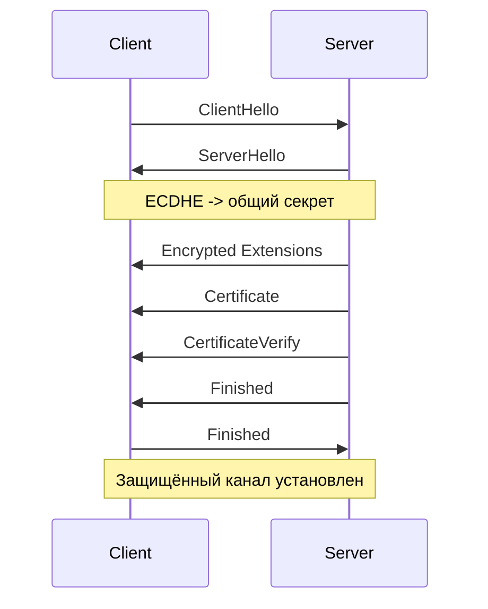

# TLS и сертификаты

Сертификаты и мир вокруг них

<!-- .slide: style="text-align: center" -->

Note:
Сегодня разбираем тему, без которой невозможно представить современный веб-бэкенд: защищённую передачу данных по сети. На прошлых лекциях мы уже обсуждали, как устроен HTTP и как клиент с сервером обмениваются запросами и ответами. В этой лекции добавляем к этому защитный слой и отвечаем на главный вопрос: как из открытого HTTP мы получаем HTTPS. Наша цель — не просто запомнить термины, а понять логику: от угроз и криптографии до практической настройки TLS в продакшене.

---

## Почему HTTP без защиты опасен

HTTP в версиях 1.x передаёт данные в открытом виде.

Это создаёт риски:

* Перехват чувствительных данных (пароли, токены, cookies);
* Подмена данных в канале;
* Атаки типа MITM (man-in-the-middle).

HTTP/2 и HTTP/3, хоть и являются бинарными протоколами, тоже требуют защиты.

Note:
Когда мы говорим, что HTTP «открытый», это означает, что по пути следования трафика данные видны тем, кто имеет доступ к каналу. Это может быть злоумышленник в публичной сети, скомпрометированный промежуточный узел или некорректно настроенная инфраструктура. В таком режиме можно не только читать данные, но и менять их по дороге: например, подменить скрипт в ответе или изменить параметры запроса. Поэтому без TLS выражение «у нас есть авторизация» само по себе недостаточно: токены и пароли всё равно можно перехватить.

Проблема открытого канала относится не только к HTTP/1.1. HTTP/2 улучшает производительность и формат передачи данных, но не заменяет криптографическую защиту. А HTTP/3 вообще строится поверх QUIC, где механизмы TLS 1.3 уже встроены в установление соединения. То есть по мере эволюции HTTP важность TLS не исчезла, а стала ещё более базовой частью веб-стека.

---

## Что именно должна дать защита

Для веб-трафика нужны три свойства:

* **Конфиденциальность** — данные нельзя прочитать по пути;
* **Целостность** — данные нельзя незаметно изменить;
* **Аутентичность** — клиент понимает, что общается с нужным сервером.

Note:
Эти три свойства удобно использовать как универсальную рамку. Конфиденциальность отвечает на вопрос «могут ли прочитать?». Целостность отвечает на вопрос «могут ли изменить незаметно?». Аутентичность отвечает на вопрос «мы точно говорим с тем сервером, с которым хотели?». Хороший защищённый транспорт должен закрывать все три пункта одновременно. TLS как протокол уровня транспорта именно это и делает.

---

## Что такое TLS в целом

**TLS (Transport Layer Security)** — это протокол защиты транспортного соединения. Его задачи:

* Проверка подлинности сервера через сертификат;
* Согласование криптографических параметров соединения;
* Получение общих ключей сессии;
* Шифрование и защита прикладного трафика.

TLS используется не только с HTTP, но и со множеством других прикладных протоколов.

Note:
TLS не заменяет HTTP и не меняет семантику запросов и ответов, а добавляет поверх транспортного соединения слой защиты. Сначала стороны договариваются о параметрах и проверяют подлинность сервера, а затем весь дальнейший HTTP-трафик идёт уже внутри защищённого канала.

TLS применяется не только в HTTPS, а вообще во множестве прикладных протоколов: почта (SMTP, POP3, IMAP), брокеры сообщений (MQTT, AMQP), каталоги, базы данных и другие клиент-серверные системы, где требуется защищённый канал.

---

## Что TLS не решает

TLS не защищает от:

* Уязвимостей приложения (SQLi, XSS, RCE);
* Утечек на endpoint (сервер/клиент);
* Ошибок бизнес-логики и контроля доступа.

TLS защищает канал, но не заменяет безопасную разработку.

Note:
Это принципиально важная граница. TLS защищает данные «в пути», но не защищает вас от уязвимого кода, утечек в логах, слабой авторизации или компрометации самого сервера. Поэтому HTTPS — обязательный, но не достаточный элемент безопасности. Его нужно рассматривать как часть общей безопасной архитектуры.

---

## Симметричное шифрование

**Симметричное шифрование** использует один и тот же ключ для шифрования и расшифровки. Часто включает в себя механихмы не только шифрования, но и проверки целостности.

Плюсы:

* Быстро работает;
* Подходит для большого объёма данных в реальном времени.

Минус:

* Нужно безопасно договориться о ключе.

Note:
Симметричная криптография — это основной инструмент для шифрования большого объёма данных. Она заметно быстрее асимметричной, поэтому именно на ней держится защищённая передача трафика после установления соединения. Главная сложность здесь не в скорости, а в том, как безопасно получить общий ключ между клиентом и сервером.

---

## Асимметричная криптография

**Асимметричная криптография** использует пару ключей: публичный и приватный.

Где полезна:

* Аутентификация сервера;
* Цифровые подписи;
* Безопасный обмен секретами.

Note:
Асимметричная схема решает главную проблему симметрии: как безопасно договориться о ключе. Публичный ключ можно передавать открыто, а приватный остаётся только у владельца. За счёт этого асимметрия хорошо подходит для проверки подлинности сервера и безопасного старта соединения.

---

## Примеры криптографических алгоритмов

Симметричное шифрование (данные сессии):

* `AES` (блочный алгоритм);
* `ChaCha20` (потоковый алгоритм).

Асимметричная криптография (подписи/обмен ключами):

* `RSA` (подписи на простых числах);
* `ECDSA` / `Ed25519` (подписи на эллиптических кривых);
* `ECDHE` (обмен ключами на эллиптических кривых).

Хэширование:

* `SHA-256`, `SHA-3`;
* Для паролей: `Argon2`, `bcrypt`.

Note:
Этот слайд лучше подавать именно как «примеры на слух», без погружения в математику и детали реализации. Достаточно зафиксировать идею: у каждого класса задач свои алгоритмы, и в реальной системе они работают вместе. Для аудитории на этом этапе важнее понять распределение ролей, чем внутреннее устройство конкретного алгоритма.

---

## Почему не шифровать всё асимметрией

Асимметричные операции:

* Существенно тяжелее вычислительно;
* Неудобны для постоянной двусторонней передачи потока данных.

Поэтому «асимметрией шифруем весь трафик» — плохая идея для веба.

Note:
Логичный вопрос: если асимметрия такая удобная, почему не использовать её для всего? Ответ простой — цена вычислений и неудобство для поточного трафика. Для веба, где много коротких запросов и высокий QPS, это слишком дорого. Поэтому асимметрия в TLS используется точечно: чтобы безопасно установить параметры сессии. А дальше всё переводится на быстрый симметричный режим.

---

## Гибридная схема TLS

В TLS используется комбинация:

* Асимметрия — для аутентификации и согласования общего секрета;
* Симметрия — для шифрования всего прикладного трафика в сессии.

Это даёт баланс между безопасностью и производительностью.

Note:
Это ключевой слайд лекции. TLS не «выбирает лучший тип шифрования», а разделяет обязанности между ними. Асимметрия помогает безопасно стартовать соединение и подтвердить подлинность стороны. Симметрия берёт на себя основной объём шифрования данных. Благодаря этому мы получаем и безопасный старт, и высокую производительность во время работы сессии.

---

## TLS и SSL

* **SSL** — устаревшее семейство протоколов;
* **TLS** — актуальный стандарт защиты транспорта;
* **HTTPS** = HTTP поверх TLS.

На практике обычно говорят «SSL-сертификат», но технически корректнее — «TLS-сертификат» или просто X.509-сертификат.

Note:
Термин «SSL» исторически закрепился в разговорной речи и интерфейсах некоторых сервисов. Но в современных системах мы используем именно TLS. С точки зрения практики, если вы видите в настройках «SSL certificate», это почти всегда сертификат для TLS-соединений. Важно понимать терминологию, чтобы не путаться в документации и при настройке продакшена.

---

## TLS 1.3 handshake

1. Клиент отправляет `ClientHello`;
2. Сервер отвечает `ServerHello` и сертификатом;
3. Клиент проверяет сертификат и параметры;
4. Стороны вычисляют сеансовые ключи;
5. Обмениваются `Finished` и переходят к защищённому каналу.

Note:
На этом уровне можно мыслить handshake как «договориться о правилах, подтвердить личность сервера, вычислить общий секрет и проверить, что обе стороны всё поняли одинаково». TLS 1.3 упростил многие устаревшие ветки по сравнению с ранними версиями, поэтому сейчас этот процесс легче анализировать и эксплуатировать. После успешного `Finished` прикладной HTTP-трафик уже идёт в зашифрованном виде.

---

## `ClientHello` и `ServerHello`

Обычно участвуют:

* Случайные значения (random);
* Поддерживаемые протоколы шифрования (cipher suites);
* Параметры key exchange (key share для ECDHE);
* `SNI` (имя домена) и `ALPN` (например, HTTP/1.1 или h2).

Note:
`ClientHello` — это предложение клиента: какие параметры он поддерживает. `ServerHello` — ответ сервера с выбранной конфигурацией. `SNI` позволяет серверу на одном IP понять, для какого домена пришёл запрос, а `ALPN` нужен, чтобы сразу договориться о протоколе уровня приложения, например HTTP/1.1 или HTTP/2. Если общие параметры не найдены, handshake прерывается.

---

## Откуда берутся сеансовые ключи

Современный TLS 1.3 обычно делает так:

* Стороны выполняют (EC)DHE и получают общий секрет;
* Из секрета и случайных значений выводятся ключи сессии;
* Далее трафик шифруется симметричными AEAD-шифрами.

Исторический RSA key exchange существовал, но в TLS 1.3 не используется.

Note:
Здесь важно обновить старую интуицию. В актуальном TLS клиент обычно не «шифрует pre-master secret публичным ключом сервера» как основной сценарий. Вместо этого стороны через (EC)DHE получают общий секрет, а потом через функцию вывода ключей получают набор ключей сессии. Такой подход даёт лучшую криптографическую устойчивость и упрощает модель безопасности.

---

## Что такое сертификат

Сертификат X.509 — это подписанный документ, где есть:

* Публичный ключ сервера;
* Идентификатор домена (SAN/CN);
* Срок действия;
* Издатель (CA) и цифровая подпись.

Note:
Сертификат — это не просто «файл для включения HTTPS». Это структурированный документ, который связывает публичный ключ и идентичность домена. Ключевой момент: сертификат подписан доверенным центром сертификации, поэтому клиент может проверить, что ключ действительно относится к заявленному домену, а не подменён злоумышленником.

---

## Пример: сертификат `my.itmo.ru`

Снимок сертификата на 5 марта 2026 г.:

| Поле                  | Значение                    |
| --------------------- | --------------------------- |
| `Subject`             | `CN = my.itmo.ru`           |
| `Issuer`              | `Let's Encrypt R13`         |
| `Validity`            | `2026-01-13` - `2026-04-13` |
| `SAN`                 | `DNS:my.itmo.ru`            |
| `Public Key`          | `RSA 2048 bit`              |
| `Signature Algorithm` | `sha256WithRSAEncryption`   |

Цепочка: `my.itmo.ru -> Let's Encrypt R13 -> ISRG Root X1`

Note:
Этот слайд полезен как привязка теории к реальному сертификату. На живом примере видно, что в сертификате действительно есть идентичность домена, информация об издателе, срок действия и публичный ключ. Здесь же можно показать, что leaf-сертификат не существует сам по себе: браузер или клиентская библиотека будут проверять и промежуточный сертификат Let's Encrypt R13, и доверие к корневому сертификату ISRG Root X1.

---

## Зачем нужна цепочка доверия

Проверка идёт по цепочке:

* Сертификат домена (leaf);
* Промежуточные сертификаты;
* Корневой сертификат CA (trusted root).

Список доверенных root-сертификатов поставляется с ОС/браузером.

Note:
Клиент редко доверяет leaf-сертификату напрямую. Он проверяет, что leaf подписан промежуточным CA, тот — следующим, и так до корневого сертификата, который уже есть в доверенном хранилище системы. Если цепочка не сходится, не хватает intermediate-сертификата или подпись недействительна, соединение будет считаться недоверенным.

---

## Как клиент проверяет сертификат

Минимальная проверка:

* Подпись и целостность цепочки;
* Срок действия;
* Совпадение домена (SAN);
* Политики отзыва/прозрачности (OCSP/CRL/CT — в зависимости от клиента).

Note:
Технически «зелёный замок» — это итог набора проверок. Клиент смотрит, не просрочен ли сертификат, соответствует ли домен, валидна ли подпись цепочки, не отозван ли сертификат и соответствует ли политикам платформы. Любая ошибка приводит к предупреждению или блокировке. Поэтому эксплуатационно важно следить не только за наличием сертификата, но и за состоянием всей цепочки.

---

## Типы сертификатов

По проверке владельца:

* `DV` — подтверждён контроль домена;
* `OV` — дополнительно проверена организация;
* `EV` — расширенная проверка (строже процесс).

По охвату имён:

* `Wildcard` (например, `*.example.com`);
* `SAN`/мультидоменный сертификат.

Note:
В продакшене чаще всего используется DV, особенно для API и внутренних сервисов, потому что он проще и дешевле в поддержке. OV и EV применяются там, где есть требования бизнеса, аудита или регуляторов. Отдельно выбирается форма охвата доменов: wildcard удобен для однотипных поддоменов, SAN — для набора разных имён в одном сертификате.

---

## Где брать сертификаты

Варианты:

* Коммерческие CA (часто OV/EV и доп. сервисы);
* Бесплатные DV через Let's Encrypt.

Практический стандарт сегодня:

* ACME-клиент + автопродление сертификатов.

Note:
Исторически сертификаты часто покупали и обновляли вручную. Сегодня стандартный путь (c конца 2015 года) — автоматизированный выпуск и продление через протокол ACME (Automatic Certificate Management Environment). Важный эксплуатационный момент: сертификат живёт ограниченное время, поэтому процесс продления нужно проектировать заранее, а не «вспоминать за день до истечения». Иначе сервис рано или поздно получит инцидент из-за просрочки.

---

## Практики настройки и эксплуатации HTTPS

* Перенаправление с `http://` на `https://`;
* **HSTS (HTTP Strict Transport Security)**;
* Отключение устаревших версий TLS и слабых шифров;
* Корректная настройка передачи цепочки сертификатов;
* Защита секретных ключей;
* Мониторинг срока действия сертификатов.

Note:
Этот слайд — про «как сделать правильно на проде». Одного факта наличия сертификата недостаточно. Нужен принудительный переход на HTTPS, HSTS для защиты от downgrade-сценариев, актуальный набор протоколов и шифров, корректная цепочка и нормальная работа с приватным ключом. На практике большинство проблем здесь не криптографические, а инфраструктурные.

Этим чек-листом удобно завершать внедрение HTTPS в любой системе. Если эти пункты закрыты, у вас обычно нет типовых критических проблем с транспортной безопасностью. Дальше остаётся регулярная эксплуатация: обновления, аудит конфигурации и мониторинг сертификатов. С точки зрения собеседований и практики это минимальный набор знаний, который ожидается от backend-инженера.

---

## Вопросы?

<!-- .slide: style="text-align: center" -->

Note:
Если хотите, в следующем блоке можем разобрать практический кейс: как посмотреть TLS-handshake в браузере, что показывает `curl -v`, и как читать вывод `openssl s_client`, чтобы быстро диагностировать ошибки сертификата и цепочки доверия.
