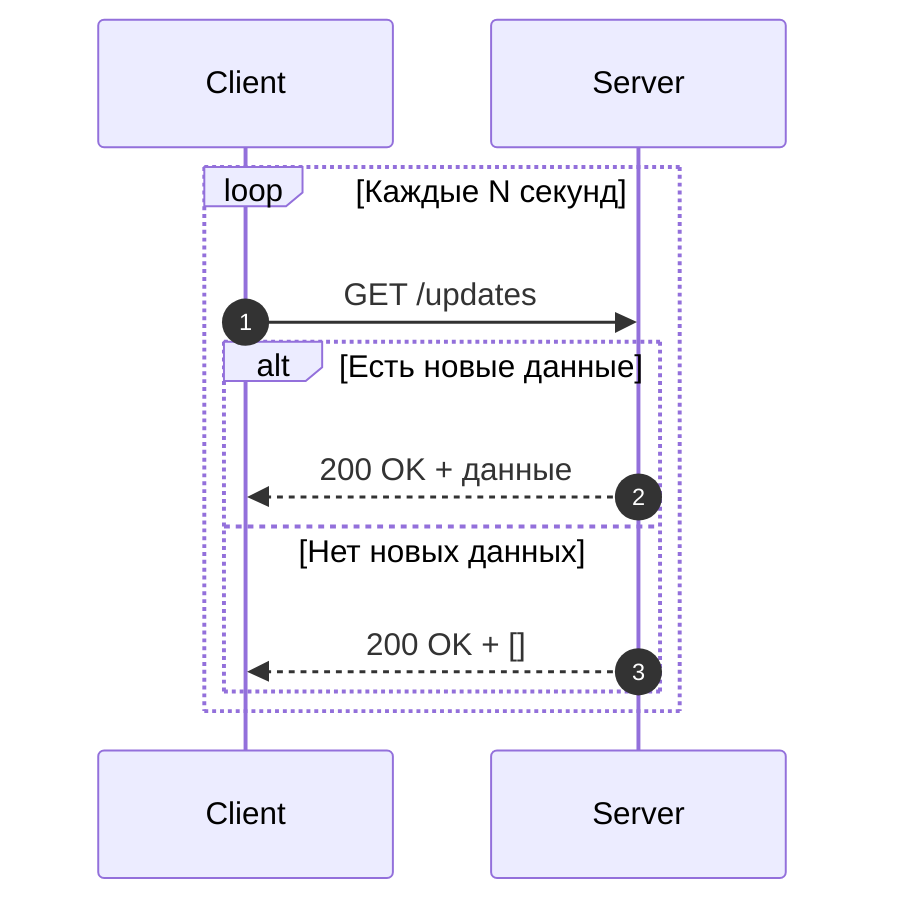
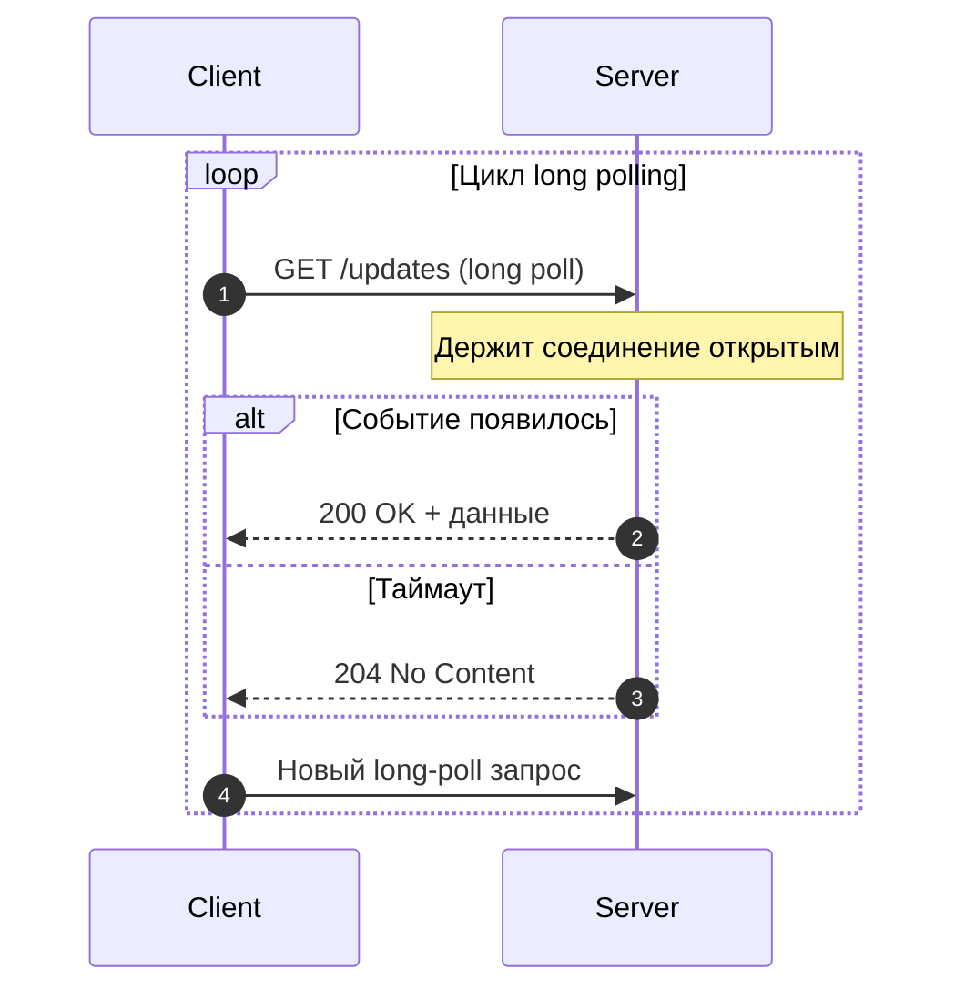

# WebSockets и SSE

Двухстороннее взаимодействие поверх HTTP

<!-- .slide: style="text-align: center" -->

Note:
В этой лекции разбираем, как в вебе решают задачу обмена данными в реальном времени. Обычный HTTP изначально строился вокруг модели request-response, и для многих прикладных сценариев этого оказывается недостаточно. Поэтому мы посмотрим, как появились polling, long polling, WebSockets и SSE, а в конце отделим их от смежных HTTP-механизмов вроде Server Push и Early Hints.

---

## Почему обычного HTTP недостаточно

Классический HTTP работает по схеме `request -> response`.

Это означает:

* Клиент инициирует общение;
* Сервер отвечает только на уже пришедший запрос;
* Сервер не может сам по себе "позвонить" клиенту.

Note:
Это фундаментальное свойство HTTP, и именно оно определяет все ограничения, которые мы дальше обсуждаем. Пока клиент не отправил запрос, сервер не имеет стандартного способа передать ему произвольное сообщение. Для страницы каталога это не проблема, но как только нам нужен чат, уведомления или обновление графиков вживую, такая модель начинает мешать.

---

## Когда нужно двухстороннее взаимодействие

Такие сценарии встречаются постоянно:

* Чаты и мессенджеры;
* Онлайн-игры;
* Совместное редактирование документов;
* Торговые терминалы и live-дашборды;
* Уведомления о событиях в реальном времени.

Note:
Во всех этих сценариях важна не просто передача данных, а передача с низкой задержкой. Пользователь ожидает, что сообщение в чате появится сразу, что статус заказа обновится без ручной перезагрузки, что другой участник документа увидит изменения почти мгновенно. То есть проблема не в том, что HTTP совсем не может это сделать, а в том, что делает это не очень удобно и не всегда эффективно.

---

## Какие есть подходы

Если серверу нужно быстро доставлять обновления клиенту, обычно рассматривают:

* `Periodic polling`;
* `Long polling`;
* `WebSockets`;
* `Server-Sent Events`.

Отдельно существуют смежные HTTP-механизмы:

* `Server Push`;
* `Early Hints`.

Note:
Здесь важно разделить две группы вещей. Первая группа действительно решает задачу доставки событий от сервера к клиенту или в обе стороны: это polling, long polling, SSE и WebSockets. Вторая группа только связана с HTTP и оптимизацией взаимодействия, но не является механизмом realtime-коммуникации в полном смысле, поэтому Server Push и Early Hints мы будем рассматривать отдельно.

---

## Periodic Polling: идея

Клиент с фиксированной периодичностью отправляет запрос:

* "Есть ли новые данные?"

Пример:

* Раз в 2 секунды делать `GET /notifications`;
* Раз в 5 секунд запрашивать состояние задачи.

Note:
Это самый наивный и одновременно самый понятный способ. Мы не меняем протокол, не вводим дополнительную инфраструктуру, а просто регулярно спрашиваем сервер, не появилось ли чего-то нового. Такой подход часто используют первым, потому что он дешёв в разработке и полностью совместим с существующим HTTP-стеком.

---

## Periodic Polling: схема обмена

1. Клиент отправляет обычный HTTP-запрос;
2. Сервер возвращает текущее состояние;
3. Клиент ждёт заданный интервал;
4. Клиент повторяет запрос снова.

Это самый простой способ имитировать near real-time.

Note:
Технически здесь нет никакой магии: мы просто часто повторяем обычный запрос. Если интервал маленький, пользователю кажется, что обновления приходят почти в реальном времени. Но на самом деле мы покупаем эту иллюзию ценой постоянных запросов к серверу, даже в тех промежутках, когда новых данных нет вообще.

---

## Periodic Polling: плюсы и минусы

Плюсы:

* Очень простая реализация;
* Работает поверх обычного HTTP;
* Легко отлаживать и масштабировать.

Минусы:

* Обновления приходят с задержкой;
* Даже без новых данных запросы продолжают идти;
* При большом числе клиентов создаёт лишнюю нагрузку.

Note:
Главное достоинство polling в том, что он очень предсказуем и прост в поддержке. Главный недостаток в том, что он неэффективен по самой своей природе: клиент спрашивает даже тогда, когда спрашивать бессмысленно. Чем меньше интервал, тем лучше ощущение realtime, но тем выше нагрузка на сеть, приложение и базу данных.

---

## Long Polling: идея

Клиент отправляет запрос, но сервер не отвечает сразу.

Сервер:

* Держит соединение открытым;
* Ждёт появления новых данных;
* Отправляет ответ только тогда, когда событие действительно произошло.

Note:
Long polling появился как попытка сделать polling умнее. Вместо того чтобы спрашивать каждые несколько секунд, клиент задаёт вопрос один раз, а сервер отвечает только тогда, когда ответ действительно появился. За счёт этого мы уменьшаем количество пустых ответов и сокращаем задержку доставки событий.

---

## Long Polling: жизненный цикл запроса

1. Клиент делает запрос;
2. Сервер ждёт событие или таймаут;
3. Когда данные появились, сервер отправляет ответ;
4. Клиент сразу открывает новый длинный запрос.

Снаружи это похоже на "почти постоянное" соединение, хотя технически это цепочка HTTP-запросов.

Note:
Это важное место: long polling не превращает HTTP в настоящий постоянный двусторонний канал. Соединение живёт дольше обычного, но после ответа всё равно закрывается, а клиент начинает новый цикл. Поэтому подход уже заметно лучше short polling, но до полноценного realtime-транспорта всё равно не дотягивает.

---

## Long Polling: плюсы и минусы

Плюсы:

* Меньше пустых запросов, чем при polling;
* Обновления приходят быстрее;
* Не требует нового протокола.

Минусы:

* Всё ещё остаётся HTTP request-response;
* Соединения висят долго, что создаёт нагрузку;
* Логика клиента и сервера становится сложнее.

Note:
На практике long polling часто оказывается промежуточным компромиссом. Он уже ближе к push-модели и уменьшает число бесполезных запросов, но при этом требует аккуратно управлять таймаутами, повторными подключениями и большим числом долго живущих соединений. То есть мы выигрываем в задержке, но усложняем поведение системы.

---

## Periodic Polling vs Long Polling

`Periodic polling`:

* Проще;
* Дешевле в реализации;
* Хуже по задержкам и эффективности.

`Long polling`:

* Быстрее реагирует на события;
* Экономит часть лишних запросов;
* Сложнее в сопровождении.

Note:
Сравнивать эти подходы удобно именно как простоту против эффективности. Если realtime не критичен и цена разработки важнее, short polling может быть вполне достаточен. Если нужна более быстрая реакция, но ещё не хочется переходить к WebSockets или SSE, long polling становится естественным следующим шагом.

---

## Зачем понадобились WebSockets

Обе polling-схемы остаются "натянутыми" поверх HTTP.

Хочется получить:

* Долгоживущее соединение;
* Передачу сообщений в обе стороны;
* Меньше накладных расходов на постоянные HTTP-запросы.

Именно эту задачу и решает `WebSocket`.

Note:
На этом этапе хорошо видно, что polling и long polling в некотором смысле борются с природой HTTP. Они пытаются из request-response модели сделать канал для обмена сообщениями. WebSocket появился как более честное решение: если приложению действительно нужен постоянный двусторонний обмен, лучше использовать протокол, который для этого и был задуман.

---

## Как устанавливается WebSocket-соединение

Классический сценарий в браузере:

1. Клиент отправляет HTTP/1.1-запрос с `Upgrade: websocket`;
2. Сервер отвечает `101 Switching Protocols`;
3. После этого стороны переходят с HTTP на протокол WebSocket.

Соединение становится постоянным и двусторонним.

Note:
Здесь важно подчеркнуть, что HTTP используется только для входа в соединение. Начало выглядит как обычный HTTP-запрос, поэтому WebSocket удобно стартует из веб-контекста. Но после ответа `101 Switching Protocols` это уже не обычный HTTP-обмен, а отдельный протокол поверх того же TCP-соединения.

---

## Что даёт WebSocket после handshake

После установки соединения:

* Клиент может отправлять сообщения в любой момент;
* Сервер может отправлять сообщения в любой момент;
* Нет необходимости открывать новый HTTP-запрос на каждое событие.

Это уже полноценный канал обмена сообщениями.

Note:
Вот здесь и появляется настоящее full-duplex-взаимодействие. Клиент и сервер перестают быть привязаны к схеме «сначала запрос, потом ответ». Обе стороны могут независимо инициировать отправку сообщений, и именно поэтому WebSocket особенно хорошо подходит для чатов, совместного редактирования и других действительно интерактивных систем.

---

## Как выглядит `Upgrade`-запрос

При установке соединения клиент отправляет примерно такие заголовки:

* `Upgrade: websocket`
* `Connection: Upgrade`
* `Sec-WebSocket-Key`
* `Sec-WebSocket-Version: 13`

Сервер отвечает:

* `101 Switching Protocols`
* `Sec-WebSocket-Accept`

Note:
Это хороший момент, чтобы показать, что WebSocket не появляется из ниоткуда. Сначала используется обычный HTTP-запрос, в котором клиент просит сменить протокол. `Sec-WebSocket-Key` нужен для проверки того, что сервер действительно понимает протокол WebSocket и корректно завершает рукопожатие. После ответа `101` обычная HTTP-семантика заканчивается, и дальше соединение живёт уже по правилам WebSocket.

---

## Как WebSocket передаёт данные

После handshake данные идут не в виде HTTP-запросов и ответов, а в виде **фреймов**.

Идея такая:

* На одном постоянном соединении передаются сообщения;
* Сообщение может состоять из одного или нескольких фреймов;
* Фреймы позволяют отделить полезные данные от служебной информации протокола.

Note:
Это важное отличие от HTTP-модели. В WebSocket после установки канала больше нет отдельных запросов и ответов на уровне протокола приложения. Есть непрерывный поток фреймов, из которых собираются сообщения. За счёт этого протокол становится легче для частого обмена небольшими порциями данных и лучше подходит для интерактивных сценариев.

---

## Что есть во фрейме WebSocket

Во фрейме обычно есть:

* Флаг завершения сообщения (`FIN`);
* Тип фрейма (`opcode`);
* Признак маскирования (`MASK`);
* Длина полезной нагрузки (`payload length`);
* Данные (`payload`).

Опционально:

* Маска для клиентских фреймов;
* Расширенная длина для больших сообщений.

Note:
На этом слайде не обязательно уходить в побитовую схему RFC. Достаточно объяснить общую идею: у каждого фрейма есть немного метаданных и полезная нагрузка. Отдельно стоит проговорить `FIN`: он показывает, завершено ли сообщение этим фреймом, или сообщение продолжается дальше. Это нужно, чтобы можно было фрагментировать большие данные и не считать, что каждое сообщение обязано помещаться в один кусок.

---

## Типы сообщений и фреймов

Основные варианты:

* `text` — текстовые данные;
* `binary` — бинарные данные;
* `continuation` — продолжение фрагментированного сообщения.

Служебные фреймы:

* `ping` — проверка, что соединение живо;
* `pong` — ответ на `ping`;
* `close` — корректное закрытие соединения.

Note:
Здесь важно разделить прикладные и служебные сообщения. `text` и `binary` несут данные приложения, а `ping`, `pong` и `close` поддерживают жизнь соединения и корректное завершение работы. Это особенно важно в реальных системах, где соединение может обрываться, простаивать или висеть за балансировщиком: heartbeat-механика обычно строится именно вокруг `ping/pong`.

---

## Зачем нужно маскирование

В классическом WebSocket:

* Фреймы **от клиента к серверу** маскируются;
* Фреймы **от сервера к клиенту** обычно не маскируются.

Это сделано для:

* Безопасности браузерного трафика;
* Снижения риска некорректной интерпретации данных промежуточными узлами.

Note:
Этот момент кажется странным, пока не знать контекст. Маскирование в WebSocket придумано не для шифрования данных и не для конфиденциальности. Оно нужно как защитный механизм на уровне протокола, чтобы трафик из браузера нельзя было слишком просто использовать в нежелательных сценариях через старые промежуточные HTTP-компоненты. Поэтому маскирование не заменяет TLS: для защиты содержимого по-прежнему нужен `wss`, то есть WebSocket поверх TLS.

---

## Плюсы и минусы WebSockets

Плюсы:

* Настоящее двустороннее взаимодействие;
* Низкие задержки;
* Хорошо подходит для частых событий.

Минусы:

* Более сложная инфраструктура;
* Нужно управлять подключениями и состоянием соединений;
* Сложнее балансировка, авторизация и обработка обрывов.

Note:
WebSocket часто воспринимают как универсальный ответ на любые realtime-задачи, но это не совсем так. Он даёт отличные характеристики по задержке и удобен для постоянного обмена сообщениями, однако требует более зрелой серверной инфраструктуры. Нужно учитывать reconnect, heartbeat, fan-out сообщений, состояние соединений и то, как всё это будет жить в распределённой системе.

---

## Типичные сценарии для WebSockets

`WebSocket` хорош, когда обмен активен в обе стороны:

* Чаты;
* Совместное редактирование;
* Многопользовательские игры;
* Торговые приложения;
* Live-обновления с пользовательскими действиями.

Note:
Общий признак у этих сценариев один: обе стороны активно участвуют в обмене. Пользователь не просто получает события, но и сам постоянно что-то отправляет, а система должна быстро раздать изменения другим участникам. Если же клиент в основном только слушает события от сервера, WebSocket может оказаться избыточным, и тогда появляется хороший повод посмотреть на SSE.

---

## Server-Sent Events: идея

`SSE` решает более узкую задачу:

* Сервер отправляет события клиенту;
* Клиент только слушает поток;
* Обратная передача данных остаётся обычным HTTP-запросом.

Это однонаправленный канал: `server -> client`.

Note:
SSE полезно воспринимать как гораздо более узкий и потому более простой инструмент, чем WebSocket. Он не пытается сделать двусторонний протокол, а решает конкретную задачу: серверу нужно долго и последовательно отправлять клиенту события. Если обратный канал не нужен или может спокойно оставаться обычным HTTP-запросом, SSE часто оказывается удобнее.

---

## Как работает SSE поверх HTTP

SSE использует обычный HTTP-ответ с типом:

* `Content-Type: text/event-stream`

Сервер:

* Не закрывает ответ;
* Периодически дописывает новые события в поток.

Браузер может потреблять такой поток через `EventSource`.

Note:
Это важное отличие от WebSocket: SSE гораздо ближе к традиционной HTTP-модели. С точки зрения транспорта это всё ещё HTTP-ответ, просто очень длинный и потоковый. За счёт этого технология проще интегрируется в веб-окружение, особенно если нужен именно поток серверных уведомлений, а не полноценный двусторонний обмен.

---

## Плюсы и минусы SSE

Плюсы:

* Проще, чем WebSockets;
* Хорошо работает для push-уведомлений от сервера;
* Основан на обычной HTTP-модели.

Минусы:

* Только одно направление: `server -> client`;
* Бинарные данные передавать неудобно;
* Не подходит для насыщенного двустороннего обмена.

Note:
Сильная сторона SSE в том, что он закрывает довольно частую бизнес-задачу без всей сложности WebSockets. Если сервер просто уведомляет браузер о новых событиях, SSE часто оказывается достаточным и проще в эксплуатации. Но как только клиенту тоже нужно активно общаться в том же канале, мы упираемся в природное ограничение этой технологии.

---

## Когда SSE лучше, чем WebSockets

`SSE` часто выигрывает, если:

* От сервера идут редкие или среднечастотные обновления;
* Клиенту не нужно постоянно отвечать в том же канале;
* Нужен более простой стек и проще эксплуатация.

Типичные примеры:

* Лента уведомлений;
* Обновление статуса фоновой задачи;
* Live-лог или поток событий мониторинга.

Note:
Ключевая мысль здесь такая: WebSocket не нужно выбирать автоматически только потому, что он "мощнее". Во многих системах обмен по сути однонаправленный: сервер сообщает, что что-то произошло, а клиент лишь отображает это пользователю. В таком случае SSE позволяет решить задачу проще и обычно дешевле по цене поддержки.

---

## Сравнение подходов

| Подход       | Направление      | Задержка        | Сложность |
| ------------ | ---------------- | --------------- | --------- |
| Polling      | клиент -> сервер | средняя/высокая | низкая    |
| Long polling | почти push       | ниже            | средняя   |
| SSE          | сервер -> клиент | низкая          | средняя   |
| WebSockets   | в обе стороны    | низкая          | высокая   |

Выбор зависит не от моды, а от профиля нагрузки и сценария общения.

Note:
Эту таблицу удобно использовать как итоговый ориентир. Чем правее мы двигаемся по сложности, тем больше возможностей получаем, но тем выше цена разработки и эксплуатации. Поэтому хороший инженерный выбор здесь редко означает "взять самый технологичный инструмент"; обычно он означает "взять минимально достаточный инструмент".

---

## Что такое HTTP/2 Server Push

`Server Push` в HTTP/2 позволял серверу заранее отправить ресурсы, которые, вероятно, скоро понадобятся клиенту.

Например:

* HTML уже запрошен;
* Сервер сразу пытается прислать CSS или JS без отдельного запроса.

Note:
Теперь важно не смешать разные идеи. Server Push тоже связан с тем, что сервер как будто что-то отправляет первым, но это не про обмен прикладными событиями. Это механизм оптимизации загрузки ресурсов страницы: сервер пытается угадать, какие связанные ресурсы клиенту вскоре понадобятся, и отправить их заранее.

---

## Почему Server Push не решает задачу realtime

`Server Push`:

* Не создаёт произвольный канал сообщений;
* Работает вокруг связанных HTTP-ресурсов;
* Не предназначен для чатов, уведомлений и потоков событий.

Это optimisation-механизм доставки ресурсов, а не транспорт для общения приложения с клиентом.

Note:
Именно поэтому ставить Server Push в один ряд с WebSockets и SSE было бы методологической ошибкой. Он не создаёт канал общения между приложением на клиенте и сервером. Это скорее историческая попытка ускорить загрузку зависимых ресурсов, а не технология для двустороннего или even server-to-client взаимодействия в бизнес-смысле.

---

## Что такое Early Hints

`Early Hints` использует статус-код `103`.

Идея:

* Сервер ещё готовит основной ответ;
* Но уже может заранее подсказать браузеру полезные ресурсы;
* Обычно это делается через заголовки `Link: rel=preload`.

Note:
Early Hints решает совсем другую задачу: сократить время ожидания перед началом загрузки критичных ресурсов. Пока основной ответ ещё формируется, сервер уже может подсказать браузеру, что стоит начать загружать заранее. Это тоже выглядит как проактивное поведение сервера, но к realtime-коммуникации отношения почти не имеет.

---

## Как Early Hints ускоряет загрузку

Сценарий выглядит так:

1. Клиент запрашивает HTML-страницу;
2. Сервер быстро отправляет `103 Early Hints`;
3. Браузер заранее начинает тянуть CSS, JS, шрифты;
4. Основной ответ приходит позже.

Это уменьшает простой на критическом пути загрузки страницы.

Note:
Практический смысл здесь в экономии времени. Без Early Hints браузер узнал бы о CSS или шрифтах только после получения основного HTML либо соответствующих заголовков в основном ответе. С Early Hints эту работу можно начать раньше, а значит, быстрее добраться до момента, когда страница станет визуально готовой.

---

## Почему Early Hints не заменяет SSE и WebSockets

`Early Hints`:

* Не передаёт поток событий;
* Не создаёт постоянное соединение;
* Не даёт двустороннего канала.

Это способ ускорить загрузку ресурсов, а не механизм realtime-коммуникации.

Note:
Этот слайд нужен, чтобы окончательно разделить в голове две категории технологий. WebSockets и SSE отвечают на вопрос "как передавать события между сервером и клиентом". Early Hints отвечает на вопрос "как раньше начать загрузку полезных ресурсов". Похожесть в том, что сервер делает что-то заранее, не должна вводить в заблуждение.

---

## Как выбирать подход под задачу

`Periodic polling`:

* Когда нужна максимальная простота;
* Когда задержка в несколько секунд допустима.

`Long polling`:

* Когда нужен push-подобный режим без смены протокола.

`SSE`:

* Когда сервер только отправляет события клиенту.

`WebSockets`:

* Когда нужен постоянный двусторонний канал.

Note:
Здесь уже можно формулировать инженерное правило выбора. Сначала нужно понять направление общения и допустимую задержку, а уже потом подбирать технологию. Если событие приходит раз в минуту, брать WebSocket только потому, что он современный, почти наверняка избыточно. Если же нужен интерактивный обмен в обе стороны, наоборот, пытаться удержаться на polling будет странным решением.

---

## Практический выбор

Здравый порядок обычно такой:

1. Сначала проверить, хватит ли обычного HTTP;
2. Затем рассмотреть polling или SSE;
3. Переходить к WebSockets, когда действительно нужен full-duplex;
4. Не использовать сложный протокол без реальной необходимости.

Чем сложнее транспорт, тем выше цена эксплуатации.

Note:
Это хороший слайд для управленческого и архитектурного вывода. Стоимость решения определяется не только тем, насколько быстро оно заработает у разработчика локально, но и тем, как его потом поддерживать в проде. Балансировщики, reconnect-логика, мониторинг, диагностика проблем и масштабирование соединений тоже входят в цену выбранного транспорта.

---

## Вопросы?

<!-- .slide: style="text-align: center" -->

Note:
На этом месте можно вернуться к практическим кейсам и предложить аудитории выбрать подход под конкретную задачу: чат, live-уведомления, обновление статуса фоновой операции, совместное редактирование. Это хороший способ проверить, что различие между polling, SSE и WebSockets действительно уложилось в голове как инженерный выбор, а не просто как набор терминов.
